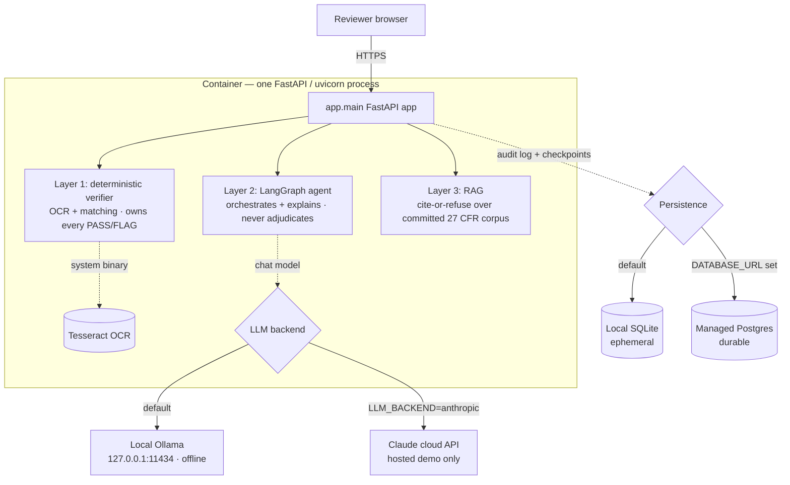

# Infrastructure

How the TTB AI Label Verification Tool is built, packaged, deployed, and run.
This is the operational companion to `Design.md` (system design), `STRATEGY.md`
(product invariants), and the `README.md` "Deploy" section.

> **One-line summary.** A single FastAPI process serves all three layers
> (deterministic verifier → conversational agent → cite-or-refuse RAG). It is
> **offline by default** — Tesseract OCR and the regulatory corpus are baked in
> at build time, nothing is persisted by default, and no request reaches the
> public internet. Two opt-in relaxations exist for the hosted demo: a cloud LLM
> backend and a managed Postgres for durable audit/checkpoints.

---

## 1. Runtime topology



The whole application is **one process**: `uvicorn app.main:app`. There is no
separate API/worker split, no message queue, and no background job runner — verify
is synchronous and stateless, and the agent runs in-process via LangGraph. This is
deliberate: the button verifier must work the instant uvicorn binds, independent of
whether a model or database is reachable.

---

## 2. Components & system dependencies

| Component | Provided by | Notes |
|-----------|-------------|-------|
| Python runtime | `python:3.12-slim` base image | CI also pins Python 3.12. |
| Web server | `uvicorn[standard]` + FastAPI | Single ASGI process; `/health` for probes. |
| OCR engine | `tesseract-ocr` system package | Bundled in the image — **no cloud OCR**. An unreadable field defers to NEEDS REVIEW rather than guessing. |
| Fonts | `fonts-dejavu-core` | Needed to render the bundled sample labels at build time. |
| Image libs | `libglib2.0-0`, `libgl1` | Runtime deps for `opencv-python-headless` (deskew/CLAHE preprocessing). |
| Agent runtime | `langgraph` + `langchain-*` | In-process; degrades gracefully when no model is present. |
| Local LLM (optional) | Ollama (agent image only) | Baked into `Dockerfile.agent`; binds loopback. |
| RAG retrieval | `rank-bm25` (always), `sentence-transformers` (optional dense) | BM25-only is the default/production regime; dense BGE-small is opt-in. |
| Persistence | SQLite (default) or Postgres (`DATABASE_URL`) | Audit log + agent checkpoints. |

Python dependencies are fully pinned in `requirements.txt` (the `pip-audit` CI gate
fails on any known CVE against a pinned dep; `starlette` is pinned explicitly to stay
ahead of its transitive CVE fixes).

---

## 3. Build-time provisioning (the offline guarantee)

Everything the running container needs is provisioned **at build time**, so request
time touches no network:

- **Tesseract + fonts + image libs** — installed via `apt-get` in the Dockerfile.
- **Sample label images** — generated by `scripts/generate_samples.py` during build
  and served as static assets (`/static/samples/*.png`).
- **Regulatory corpus** — committed in-repo under `rag/corpus/*.json` (citation-tagged
  27 CFR excerpts + the class/type designations dataset); copied into the image. No
  live eCFR ingest at runtime.
- **Local model (agent image only)** — `Dockerfile.agent` installs Ollama and **bakes
  the model into the image** (`scripts/setup_ollama.sh`) so the container makes zero
  outbound calls at run time.

The `OFFLINE` env var (default on) is a guard: code paths that would reach the public
internet must refuse when it is set.

---

## 4. Deployment modes

Three supported shapes, from leanest to fully self-contained:

### Mode A — Hosted demo on Render (the live URL)

- Declared in `render.yaml`: a Docker **web service** (`./Dockerfile`) on the
  **Starter** plan (the free tier's 0.1 CPU is too throttled for OCR) + a managed
  **Postgres** (`ttb-audit-db`, free plan — note: expires after 90 days).
- `healthCheckPath: /health`, `autoDeploy: true` → **deploys on every push to `main`**.
- `DATABASE_URL` is wired from the managed database, so the audit log and agent
  checkpoints persist across redeploys (Render's disk is otherwise ephemeral).
- The agent uses **Claude via the cloud API** (`LLM_BACKEND=anthropic` +
  `ANTHROPIC_API_KEY` secret) because the Starter host can't run a local model. This
  is the **one explicit, opt-in relaxation** of "fully offline," scoped to the demo.
- Deploy manually with `scripts/deploy_render.sh` (after `render login`) or from the
  dashboard.

```bash
docker build -t ttb-label-verification .
docker run -p 8000:8000 ttb-label-verification
```

### Mode B — Lean container anywhere

Same default `Dockerfile` run on any Docker host. The button verifier + BM25 RAG work
fully; with no local model and no `LLM_BACKEND`, the `/chat` panel **degrades
gracefully** (the button path is always available). SQLite persistence is ephemeral
unless you mount a volume or set `DATABASE_URL`.

### Mode C — Full offline stack on one box (`Dockerfile.agent`)

All three layers on a ~4 GB box with **zero outbound calls at request time**: bundles
Ollama, bakes the model in at build, and persists audit/checkpoints to a mounted volume.

```bash
docker build -f Dockerfile.agent -t ttb-label-agent .   # --build-arg OLLAMA_MODEL=qwen2.5:3b-instruct to swap
docker run -p 8000:8000 -v ttb_agent_data:/app/.agent_data ttb-label-agent
```

`scripts/agent_entrypoint.sh` starts Ollama on loopback, waits for it, then `exec`s
uvicorn (so uvicorn is PID 1 and receives stop signals). Dense RAG (BGE-small/Chroma)
is host-deferred — uncomment the `pip install` in `Dockerfile.agent` to enable it.

---

## 5. Persistence

| Data | Default (offline) | Durable (hosted) | Selected by |
|------|-------------------|------------------|-------------|
| Append-only **audit log** | SQLite at `AGENT_AUDIT_DB` | Postgres | `DATABASE_URL` set → Postgres |
| Agent **conversation checkpoints** | SQLite at `AGENT_CHECKPOINT_DB` | Postgres | `DATABASE_URL` set → Postgres |
| Verify results | **not persisted** (stateless) | — | — |
| Uploaded images | **not persisted** (in-memory for the request) | — | — |

When `DATABASE_URL` is set to a Postgres DSN, both the audit log and checkpoints move
there automatically (`agent/config.py`, `app/agent_chat.py`). Render hands out
`postgres://` DSNs, which SQLAlchemy 2.x rejects, so `config.audit_db_url()` normalizes
them to the `postgresql+psycopg://` form. Unset → local SQLite, fully offline, no
Postgres dependency. **No verify input or PII is persisted in either mode.**

---

## 6. Configuration (environment variables)

All values are local/offline by construction; everything below is an override. No
secret is required to run — the defaults stand up a fully functional offline instance.

| Variable | Default | Purpose |
|----------|---------|---------|
| `PORT` | `8000` | uvicorn bind port. |
| `OFFLINE` | `1` (on) | Guard: internet-bound code paths refuse when set. |
| `DATABASE_URL` | _(unset)_ | Postgres DSN → durable audit log + checkpoints. Unset → SQLite. |
| `AGENT_AUDIT_DB` | `.agent_data/audit.sqlite` | SQLite path for the audit log (when no `DATABASE_URL`). |
| `AGENT_CHECKPOINT_DB` | `.agent_data/checkpoints.sqlite` | SQLite path for agent checkpoints. |
| `LLM_BACKEND` | `ollama` | `ollama` (local, offline) or `anthropic` (cloud Claude — hosted demo). |
| `ANTHROPIC_API_KEY` | _(unset)_ | Required only when `LLM_BACKEND=anthropic`. Host secret — never committed. |
| `ANTHROPIC_MODEL` | `claude-haiku-4-5-20251001` | Cloud model id (when using Anthropic). |
| `OLLAMA_MODEL` | `llama3.2:3b` | Local model id. |
| `OLLAMA_BASE_URL` | `http://127.0.0.1:11434` | Local Ollama endpoint (loopback). |
| `LLM_TEMPERATURE` | `0.0` | Deterministic generation. |
| `RAG_DENSE` | `auto` | `auto` (dense if importable, else BM25), `off` (BM25-only), `on` (require dense). |
| `RAG_DENSE_STORE` | `memory` | `memory` (in-process numpy cosine) or `chroma` (persistent). |
| `RAG_TOP_K` | `5` | Retrieved chunks per query. |
| `RAG_MIN_CONFIDENCE` | `0.50` | Term-coverage floor below which regulatory tools **refuse**. |
| `RAG_DENSE_MIN_SIM` | `0.80` | Dense-similarity floor for the high-confidence dense assist. |

`.env.example` documents the (optional) secrets; copy to `.env` (gitignored) only if
wiring an integration. **Production / CI run BM25-only (`RAG_DENSE=off`)** — the same
retrieval regime, so no embedding model is needed.

---

## 7. Networking & security posture

- **Health check:** `GET /health` → `{"status": "ok"}` (used by Render and the
  container `HEALTHCHECK`).
- **Security headers on every response** (including errors), set by an HTTP middleware
  in `app/main.py`:
  - `X-Content-Type-Options: nosniff`
  - `X-Frame-Options: DENY`
  - `Referrer-Policy: strict-origin-when-cross-origin`
  - `Permissions-Policy: camera=(), microphone=(), geolocation=()`
  - `Content-Security-Policy: default-src 'self'; img-src 'self' data:; style-src 'self' 'unsafe-inline'; script-src 'self'; object-src 'none'; base-uri 'self'; frame-ancestors 'none'` — no inline scripts (the print button uses a listener, not `onclick`).
- **Upload limits:** 10 MB per image (`_MAX_FILE_BYTES`; oversized → HTTP 413); batch
  capped at 25 labels (`BATCH_MAX_LABELS`); ZIP guards at 10 MB/member and 50 MB total
  uncompressed; OCR rejects images over 40 MP / 2000 px longest edge.
- **No PII at rest:** verify is stateless; uploads are processed in memory and not
  stored; only the audit log (overrides/actions) and chat checkpoints persist, and
  only when configured to.
- **Outbound:** none at request time in the offline modes. The only deliberate
  exception is `LLM_BACKEND=anthropic` on the hosted demo.

---

## 8. CI/CD

**CI** — `.github/workflows/ci.yml`, on every push to `main` and every PR. Needs no
API key (nothing constructs an LLM or hits the network):

1. **Tests + agent-eval gate** — installs Tesseract + fonts, runs the full `pytest`
   suite (pinned BM25-only via `tests/conftest.py`), then the **agent-behavior gate**
   (`python eval/run_agent_eval.py gate`) which replays committed snapshots and grades
   the load-bearing invariants (verdict-verbatim, tool routing, confirm-gate,
   cite-or-refuse) — **no LLM, no credits**.
2. **Dependency CVE audit** — `pip-audit -r requirements.txt`.

**CD** — Render `autoDeploy: true` builds the Docker image and deploys on every push to
`main`; health-gated at `/health`.

> **Eval harnesses** (not CI gates, run manually): `eval/run_eval.py` (verifier core
> accuracy board), `eval/run_rag_eval.py` (RAG hit/faithfulness/citation), and the
> **live** `eval/run_agent_eval.py record` (spends Anthropic credits; refreshes the
> snapshots the free gate replays).

---

## 9. Capacity, scaling & operational notes

- **Latency budget:** < 5 s per verify (typically < 1 s). OCR is the cost center, which
  is why the hosted demo uses Render **Starter**, not the throttled free 0.1-CPU tier.
- **Concurrency:** synchronous verify within a single uvicorn process; scale by running
  more replicas behind a load balancer. State (audit/checkpoints) externalizes cleanly
  to Postgres, so replicas are safe to add when `DATABASE_URL` points at a shared DB.
- **Statelessness:** the verify path holds no session state, so a redeploy/restart loses
  nothing of record (only in-flight requests).
- **Free-tier caveats:** the Render free Postgres expires after 90 days — upgrade for
  anything beyond the POC demo. Without `DATABASE_URL`, SQLite is wiped on each redeploy.
- **Image sizes:** lean `Dockerfile` is small; `Dockerfile.agent` is ~4 GB (bundles
  Ollama + a 3B model).

---

## 10. Out of scope (POC boundaries)

No COLA/government-system integration, no auth or multi-user roles, no real PII, no
async/large-batch (>25) processing. These are explicit non-goals (`STRATEGY.md`), not
gaps — the deterministic core, the human-gated writes, and the offline default are the
load-bearing invariants this infrastructure is built to preserve.
