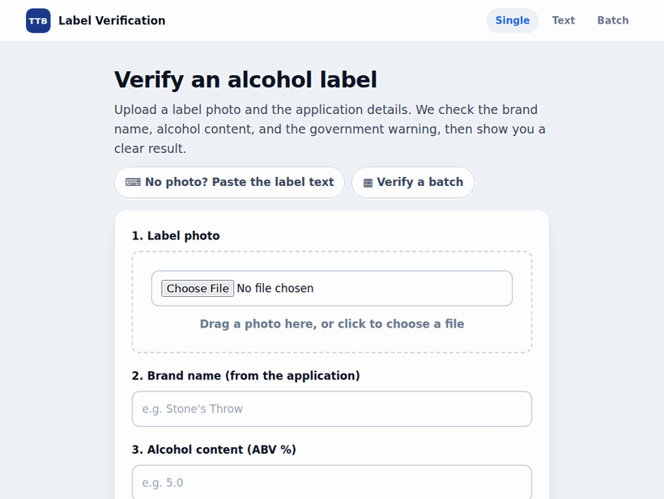

# TTB AI Label Verification Tool

A proof-of-concept web app for TTB compliance agents. Upload a label photo plus
the claimed application data (brand name, alcohol content); the app reads the
label locally and returns a clear **PASS / FLAG** for each of three checks —
brand name, alcohol content, and the mandatory government warning — in under a
second.

This is a standalone POC. It is **not** integrated with COLA or any government
system, stores nothing, and handles no real PII.

**🔗 Live demo:** https://ttb-label-verification-9q01.onrender.com — upload a
label, or try one of the three bundled samples with one click.



<sub>Upload screen → a clean label PASSes all three checks → a non-compliant
label is FLAGGED. ([upload](docs/media/home.png) · [PASS](docs/media/result-pass.png) · [FLAG](docs/media/result-flag.png) stills)</sub>

---

## What it checks

| Field | Strategy | Why |
|-------|----------|-----|
| **Brand name** | Fuzzy / tolerant | Formatting differences are not violations. `STONE'S THROW` matches `Stone's Throw`. Normalize (lowercase, strip punctuation/whitespace) then compare at a 95 similarity cutoff. |
| **Alcohol content** | Numeric | `5%`, `5.0%`, `ALC 5.0% BY VOL`, and proof (`10 PROOF` = 5% ABV) all match a claimed `5.0`. A genuinely different number FLAGs. |
| **Government warning** | Strict, exact | Requires the literal all-caps `GOVERNMENT WARNING:` and the exact 27 CFR §16.21 wording. Title case (`Government Warning`), altered wording, or missing text = FAIL. Only whitespace (OCR line-wrapping) is tolerated. |

The expected warning defaults to the official §16.21 text, so an agent never types it.

---

## Quick start

Requires Python 3.12 and Tesseract OCR.

```bash
# 1. Tesseract (system binary)
sudo apt-get install -y tesseract-ocr        # Debian/Ubuntu
# macOS: brew install tesseract

# 2. Python deps
python -m venv .venv && source .venv/bin/activate
pip install -r requirements.txt

# 3. Generate the bundled sample labels
python scripts/generate_samples.py

# 4. Run
uvicorn app.main:app --reload
# open http://127.0.0.1:8000
```

No root for the Tesseract install? You can extract the `.deb` into a local prefix
and point the app at it — `app/ocr.py` auto-detects a Tesseract under
`~/.local/tess` when none is on `PATH`.

---

## Tests and evaluation

```bash
pytest                    # 135 unit + end-to-end tests
python eval/run_eval.py   # goal metrics + latency report -> eval/REPORT.md
```

The goal is **< 1% margin of error, < 5 s latency**. The board scores the system on
its **intended input** — the label image an agent submits with a COLA application —
across 16 cases: 3 clean labels, 10 degraded variations (real photo/scan artifacts),
and 3 varied product-label images. Each case is either a **confident verdict** or a
**safe deferral**; the only failure is a *confident wrong* verdict.

- **Confident coverage — 16/16 = 100%** — the system commits a verdict on every
  in-scope case.
- **Decision correctness — 16/16 = 100%**, **zero wrong verdicts**.
- **Margin of error — 0.00%** (0 wrong of 16 confident verdicts). **Meets the < 1% goal.**
- **Logic-on-clean accuracy — 100%** (9/9 field decisions on cleanly-read text).
- **Max latency — ~290 ms** (budget 5000 ms), well under the bar.

Per-case outcomes on the degraded set (a ✗ cell is an OCR misread; the *outcome*
is the decision the system made about it — all now confident-correct):

| Degraded photo (failure mode) | Brand | ABV | Warning | Outcome |
|-------------------------------|:-----:|:---:|:-------:|---------|
| 5° rotation                   |   ✓   |  ✓  |    ✓    | ✅ correct |
| 8° rotation (heavy)           |   ✓   |  ✓  |    ✓    | ✅ correct |
| Gaussian blur                 |   ✓   |  ✓  |    ✓    | ✅ correct |
| JPEG compression (q30)        |   ✓   |  ✓  |    ✓    | ✅ correct |
| Low contrast                  |   ✓   |  ✓  |    ✓    | ✅ correct |
| Perspective / keystone        |   ✓   |  ✓  |    ✓    | ✅ correct |
| Glare / overexposure          |   ✓   |  ✓  |    ✓    | ✅ correct |
| Shadow / uneven lighting      |   ✓   |  ✓  |    ✓    | ✅ correct |
| Sensor noise                  |   ✓   |  ✓  |    ✓    | ✅ correct |
| Blur + rotation (compound)    |   ✓   |  ✓  |    ✓    | ✅ correct |

**10/10 degraded photos now get a confident-correct verdict.** Three preprocessing
steps and a tolerant-but-strict warning matcher make this honest rather than lucky:
(1) **deskew** straightens rotated labels, **CLAHE contrast** normalizes uneven
lighting (recovers a brand whose start was lost to a left-side shadow), and
**upscaling** enlarges low-res uploads so a heavily-compressed image's warning reads
(jpeg q30 went from ~73% to ~93% confidence); (2) the warning check is **strict on
wording/casing but tolerant of OCR noise** — it fuzzy-matches the §16.21 body
(compliant reads score ≥ 99.6%) instead of demanding all 283 characters verbatim, so
a one-character OCR slip no longer false-FLAGs a compliant label.

### Out-of-scope: real-world bottle photography

The eval also keeps three **real phone photos of bottles** (Jack Daniel's, Cîroc,
Grey Goose, in `eval/images/real/`) as a *stress test* — glare, reflections, dark
backgrounds, thin metallic label text. This is **not** the product's input (a
submitted label image), and local Tesseract (a hard requirement) can't read them.
The point: all three **safely defer to human review** and **none produces a wrong
verdict** — the system declines to guess rather than mis-flagging a compliant label.
They are reported separately and not counted in the board above. Drop more photos
into `eval/images/real/` with a `brand|abv|exp_brand,exp_alcohol,exp_warning`
sidecar to extend the stress set.

Latency stays far under the 5-second budget: **~150–300 ms server compute locally**,
and **~550–750 ms on the live Render Starter instance** (~1 s round-trip including
network).

---

## Approach & tools

- **FastAPI + Jinja2 + vanilla CSS**, server-rendered. One upload screen, one
  results screen, large targets — no JS build step. Built to be usable by the
  least tech-comfortable agent.
- **Tesseract OCR (pytesseract)**, fully local. The target deployment blocks
  outbound traffic to external ML/cloud APIs, so OCR runs in-process. Tesseract
  easily meets the latency budget on a legible label.
- **rapidfuzz** for fuzzy brand matching; plain numeric logic for ABV; exact
  string logic for the warning.
- **Stateless** — nothing is persisted; each request is processed and discarded.

```
app/
  reference.py   # pinned official §16.21 warning text
  ocr.py         # Tesseract wrapper + readability gate
  matching.py    # fuzzy brand, numeric ABV, strict warning
  verify.py      # orchestrator: OCR -> matchers -> result
  models.py      # VerificationResult
  main.py        # FastAPI routes + templates
eval/            # labeled set + honest accuracy/latency report
agent/           # Layer 2 — LangGraph chat agent (graph, tools, confirm gate, audit)
rag/             # Layer 3 — local citation-grounded knowledge layer
tests/           # unit + end-to-end tests
```

---

## AI assistant (Layer 2) + regulatory knowledge (Layer 3)

On top of the deterministic core, an additive **conversational agent** (`/chat`)
lets an agent drive every feature in plain language, and a local **RAG knowledge
layer** answers regulatory questions with citations. The governing rule everywhere:
**the LLM orchestrates and explains; it never adjudicates.** Pass/fail is always the
deterministic core's; RAG grounds explanations but gets no vote; a human commits
every change.

- **LangGraph agent, local model.** Tools *wrap* the core (single source of truth):
  `verify_label` returns the identical verdict to the button UI. The model is local
  **Ollama** (`langchain-ollama`); a `SqliteSaver` checkpointer keys session memory
  and interrupt/resume by `thread_id`. Streaming SSE chat with **visible tool steps**;
  vanilla JS, no build step. The button UI stays the primary, always-available path.
- **Human-in-the-loop confirm gate.** Read tools flow through; before any **write**
  (`override_result`, `manual_fallback`, `batch_verify`) the graph calls `interrupt()`
  and resumes only on an explicit human **Approve** — the agent can never auto-commit.
  Every write is recorded to an **append-only audit log** (who/what/when/why).
- **Citation-grounded RAG, cite-or-refuse.** Hybrid retrieval (BM25 now; dense
  BGE-small/Chroma host-deferred) over a committed, citation-tagged 27 CFR corpus
  (Part 16 + Part 4 wine). `regulatory_lookup` and `explain_flag` answer **only** from
  retrieved chunks, always cite the controlling section, and **refuse** ("not found in
  the regulations on file") when unsupported — never reciting regulation from memory.
  RAG eval: hit-rate 100%, faithfulness 100%, citation 100% (`eval/run_rag_eval.py`).
- **Fully offline.** No outbound calls at runtime (local Tesseract, local BM25, local
  Ollama) — proven by `tests/test_offline.py`, which blocks outbound sockets and runs
  the verify + RAG paths.

> The deterministic 5 s SLA is unaffected: verification is a single tool call **off**
> the model path, and RAG stays off the hot path. When the model is unavailable, the
> chat degrades gracefully and the button verifier keeps working.

---

## Deploy

Docker bundles the Tesseract binary so it survives a locked-down runtime.

```bash
docker build -t ttb-label-verification .
docker run -p 8000:8000 ttb-label-verification
```

`render.yaml` declares a Docker web service for one-click deploy on Render;
`scripts/deploy_render.sh` is a one-command deploy once `render login` is done.
The live instance runs on Render's **Starter** plan (free tier's 0.1 CPU is too
throttled for OCR — see the latency note below). Health check at `/health`.

The **conversational agent** needs a local Ollama model, which the Starter host
can't run — there the chat degrades gracefully and the button verifier is the path.
To run the full agent + RAG, deploy on a ~4 GB host and provision the model first:
`bash scripts/setup_ollama.sh` (everything stays local; no outbound calls).

---

## Trade-offs & known limitations

> **Master-brief Phase-1 mapping.** This repo *is* the brief's Layer-1
> verification core. The function names differ from the brief's pseudo-names
> (`extract_text`/`extract_text_data` ≈ `extract_fields`; `match_brand` +
> `match_alcohol_content` ≈ `fuzzy_match`; `match_government_warning` ≈
> `verify_warning_strict`), and OCR structures the three verdict-bearing fields
> (brand, ABV, warning) rather than the brief's seven. **One deliberate deviation:**
> the brief specifies a *strict, word-for-word* warning match, but the implemented
> matcher is a **high-threshold fuzzy match (≥ 99% similarity)** anchored on the
> ALL-CAPS `GOVERNMENT WARNING:` header. This was a measured choice — exact-substring
> matching false-flagged compliant labels whenever OCR dropped a single character in
> the 283-char §16.21 block; the fuzzy threshold tolerates that noise while still
> failing Title-case, missing, or genuinely-altered warnings (see `eval/REPORT.md`,
> 0% confident-error margin). The agent + RAG layers (Phases 2–3) are planned in
> `docs/plans/2026-06-18-001-feat-conversational-agent-rag-plan.md` and not yet built.

- **Bold-text detection is intentionally skipped.** The warning legally must also
  be **bold**, but font weight is unreliable to detect from a photographed label
  via OCR. We verify presence, exact wording, and ALL CAPS — not boldness. This is
  a deliberate, documented cut, not an oversight.
- **Accuracy is scoped to the goal's definition.** `<1%` margin of error is
  measured on the verdicts the system *commits to*: **0 wrong of 11 confident
  verdicts (0.00%)**, with the decision logic on clean text at 100%. Hard reads are
  deferred to human review (reported as *coverage*), not counted as errors or
  hidden — see the eval report.
- **Warning matching is strict on wording and casing, but tolerant of OCR noise.**
  It requires the official §16.21 text in ALL CAPS and FLAGs Title-case or altered
  wording — but it *fuzzy-matches the body* (compliant reads score ≥ 99.6%), so a
  one-character OCR slip no longer false-FLAGs a compliant label. When the warning
  region can't be read at all, it **defers to NEEDS REVIEW** rather than asserting
  non-compliance. (A genuinely-missing warning on a pristine image therefore also
  defers — a conservative, never-false-pass choice; region-aware confidence to
  separate "absent" from "unreadable" is a candidate next step.)
- **Real-world bottle photos often read poorly — and the app says so rather than
  guessing.** A glare-lit phone photo (small label in a busy frame, curved glass)
  can OCR to near-garbage. Two safeguards keep that honest: (1) when OCR confidence
  is low the verdict is **NEEDS REVIEW — low confidence read**, not a confident
  PASS/FAIL; (2) each field only reports a match it actually earned — the fuzzy
  brand matcher requires a genuine similarity score, so garbled text scores low and
  FLAGs instead of falsely passing. (A real Cîroc or Grey Goose bottle photo, for
  example, reads at ~30–40% confidence on its thin reflective label, so the whole
  result defers to NEEDS REVIEW rather than guessing.) The bundled samples and most
  of the eval set are clean/degraded *flat* labels — expect more NEEDS-REVIEW
  outcomes on real bottle photography.
- **Agent/RAG: two pieces are host-deferred, documented honestly.** (1) The chat
  agent needs a local **Ollama** model; the deployed button-UI host (Render Starter)
  can't run one, so on that instance the chat degrades gracefully and the button
  verifier is the path — running the full agent needs a ~4 GB host
  (`bash scripts/setup_ollama.sh`). (2) RAG retrieval is **BM25-only** until the
  **dense BGE-small/Chroma** backend is enabled on a provisioned host (the
  `DenseBackend` seam in `rag/retrieve.py`); BM25 is strong for term-heavy
  regulatory queries, dense would add synonym recall.
- **RAG corpus is a curated excerpt, not the full live eCFR.** The committed corpus
  is 27 CFR Part 16 + a Part 4 (wine) slice, citation-accurate and offline; §16.21 is
  verbatim. The full live ingest of Parts 4/5/7/16 + the TTB Beverage Alcohol Manual
  is the deferred build-time step. Every chunk carries a `source_url` to verify
  against eCFR.
- **Out of scope for this POC.** COLA / government-system integration and
  authentication are deliberately not built (candidate next steps). Batch
  verification, the low-confidence "needs review" state, the conversational agent,
  and the RAG layer — originally deferred — are now implemented.
- **OCR is CPU-bound, so the host's CPU sets the latency.** On a normal CPU the
  full verify is ~200 ms (well under the 5 s budget). Tesseract is tuned for
  constrained hosts (`--psm 6`, single OpenMP thread). Note that a heavily
  throttled instance (e.g. Render's free 0.1-CPU tier) can push a single OCR
  call to ~20 s — use at least ~0.5–1 CPU (Render Starter/Standard or equivalent)
  to keep verifications under 5 s.

---

## License

[MIT](LICENSE) © 2026 Jayce Parabellum
