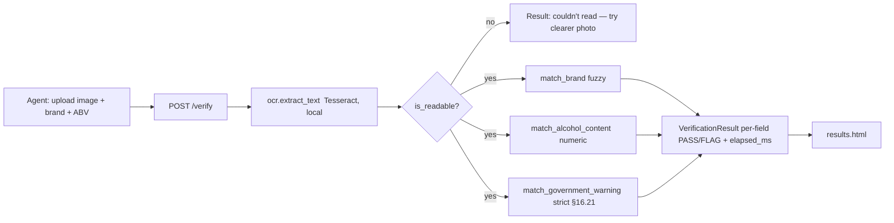

<!-- /autoplan restore point: /home/jayce/.gstack/projects/ttb-label-verification/main-autoplan-restore-20260617-131244.md -->
---
title: "feat: AI-Powered Alcohol Label Verification POC"
status: completed
date: 2026-06-17
origin: docs/brainstorms/2026-06-17-label-verification-requirements.md
depth: standard
---

# feat: AI-Powered Alcohol Label Verification POC

## Summary

Build a standalone proof-of-concept web app where a TTB compliance agent uploads
a label image plus claimed application data (brand, alcohol content) and receives
a per-field PASS/FLAG verdict in under 5 seconds. Brand and ABV use fuzzy/tolerant
matching; the government warning is checked strictly against the official
27 CFR §16.21 text (which is the default expected value). Processing is fully
local (Tesseract OCR — no outbound ML/cloud calls), stateless, and deployed to a
shareable public URL.

This is greenfield. Several core modules already exist in the repo from an early
build pass (`app/reference.py`, `app/matching.py`, `app/ocr.py`, `app/verify.py`,
`app/models.py`, `app/samples.py`); the plan treats them as the intended target
shape and sequences the remaining work (web UI, sample images, tests, deploy,
docs) plus a verification pass over what exists.

---

## Problem Frame

TTB compliance agents spend ~half their day manually confirming a label's artwork
matches its application, across ~150,000 applications/year with 47 agents. A prior
vendor tool was abandoned for being too slow (30–40s) and clunky. The POC must win
one bet: agents trust the verdicts enough to use it instead of their own eyes —
because it is faster (<5s) and clearer. Out of scope: batch, image-quality
correction, COLA integration, auth, persistence (see origin Scope Boundaries).

---

## Requirements Traceability

- **R1** Fuzzy brand match, formatting-insensitive (`STONE'S THROW` == `Stone's Throw`). → U3
- **R2** Numeric ABV match incl. proof = 2×ABV (`5%`/`5.0%`/`ALC 5.0%` == `5.0`). → U3
- **R3** Strict warning match: exact §16.21 wording + all-caps header; title-case fails. → U2, U3
- **R4** Warning defaults to official §16.21 text. → U2, U7
- **R5** Per-field PASS/FLAG result view, found-vs-expected, readable. → U7
- **R6** Honest "couldn't read" fallback on unreadable image. → U4, U5, U7
- **R7** 3 bundled one-click sample labels (clean / ABV mismatch / bad warning). → U6, U7
- **R8** <5s end-to-end latency (measured). → U8
- **R9** <1% error on decision logic given correct text (unit-tested). → U3, U8
- **R10** Local OCR only (no outbound calls). → U4, U9
- **R11** Deployed, shareable public URL. → U9
- **R12** README: setup, run, approach, trade-offs incl. bold-detection caveat. → U10

---

## Key Technical Decisions

- **Local Tesseract over cloud vision.** Deploy environment blocks outbound ML
  APIs; Tesseract runs in-process and meets <5s on a legible label. (see origin)
- **Server-rendered UI (FastAPI + Jinja2 + vanilla CSS), no JS build.** Simplest
  path to a large-target, low-tech-friendly single screen; fewest moving parts.
- **Error budget scoped to decision logic on correct text.** <1% is verified by
  unit tests over the matchers with known inputs; OCR legibility is a documented
  limitation, surfaced as "couldn't read" rather than a wrong verdict. (see origin)
- **Brand: normalize-first, then rapidfuzz ~95 cutoff.** Lowercase + strip
  punctuation + collapse whitespace runs *before* scoring, so formatting
  differences score 100; the cutoff only governs residual OCR noise.
- **ABV: exact after numeric normalize** (epsilon 0.05 for float only), with
  proof understood as 2×ABV.
- **Warning: case-sensitive exact wording, whitespace-tolerant.** OCR line-wraps
  are collapsed; casing and wording are not — title-case `Government Warning` fails.
- **Stateless, no database.** Nothing persisted; ephemeral request processing.
- **Deploy via Docker on Render**, because the image must bundle the Tesseract
  system binary to survive the locked-down runtime.

---

## High-Level Technical Design

Request pipeline (single screen → single result):



---

## Output Structure

```
app/
  __init__.py
  reference.py        # pinned §16.21 text (exists)
  matching.py         # fuzzy brand, numeric ABV, strict warning (exists)
  ocr.py              # Tesseract wrapper + readability gate (exists)
  models.py           # VerificationResult (exists)
  verify.py           # orchestrator (exists)
  samples.py          # bundled sample metadata (exists)
  main.py             # FastAPI app + routes (NEW)
  templates/
    index.html        # upload/confirm screen (NEW)
    results.html      # per-field PASS/FLAG view (NEW)
  static/
    style.css         # large, clean, low-tech (NEW)
    samples/*.png      # generated sample labels (NEW)
scripts/
  generate_samples.py # Pillow label generator (NEW)
tests/
  test_matching.py    # fuzzy/strict/ABV cases (NEW)
  test_verify.py      # orchestrator incl. latency (NEW)
Dockerfile            # bundles tesseract-ocr (NEW)
render.yaml           # Render blueprint (NEW)
README.md             # setup/run/approach/trade-offs (NEW)
requirements.txt      # deps (exists)
```

---

## Implementation Units

### U1. Dev environment & dependency setup

**Goal:** A reproducible local environment that can run OCR and the web app, plus
the deploy-time toolchain.
**Requirements:** R10
**Dependencies:** none
**Files:** `requirements.txt` (exists), `.gitignore` (exists)
**Approach:** Python deps are blocked by PEP 668 for `--user`; create an isolated
env with the `virtualenv` package (works without the missing `python3-venv`).
Tesseract needs root via `apt`, but `sudo` is non-interactive here — fall back to
downloading the `tesseract-ocr` + `tesseract-ocr-eng` `.deb`s and their missing
shared-lib deps, extracting with `dpkg-deb -x` into a local prefix, and exporting
`PATH` + `TESSDATA_PREFIX`. If neither works locally, OCR is still validated in
the Docker image (U9); document the manual `apt install tesseract-ocr` step.
**Execution note:** This is the known project risk — resolve before U4/U8 can run
end-to-end. Logic units (U2/U3) do not depend on Tesseract.
**Test scenarios:** Test expectation: none — environment setup. Verification is
`tesseract --version` succeeds and `python -c "import fastapi,rapidfuzz,pytesseract,PIL"` succeeds.
**Verification:** Both commands succeed in the chosen environment.

### U2. Regulatory reference (§16.21)

**Goal:** Pin the exact official warning string as the strict reference + default.
**Requirements:** R3, R4
**Dependencies:** none
**Files:** `app/reference.py` (exists)
**Approach:** Verbatim §16.21 text (verified against Cornell LII 2026-06-17) plus
the `GOVERNMENT WARNING:` header constant. No paraphrasing.
**Test scenarios:** `Test expectation: none` directly (constants), but its
correctness is exercised through U3's warning tests. Covers AE: exact-text PASS.
**Verification:** Constant matches the verified §16.21 wording character-for-character.

### U3. Matching core (fuzzy brand, numeric ABV, strict warning)

**Goal:** The decision logic — the heart of the <1% accuracy bar.
**Requirements:** R1, R2, R3, R9
**Dependencies:** U2
**Files:** `app/matching.py` (exists), `tests/test_matching.py` (NEW)
**Approach:** Three matchers returning a common `FieldResult`. Brand: normalize
(lowercase/strip-punct/collapse-ws) then `rapidfuzz` ratio/partial_ratio ≥95.
ABV: regex-extract `%`, `ALC/VOL`, and `proof` numbers; proof/2; exact within 0.05.
Warning: whitespace-collapse both sides; require all-caps header substring AND
exact-wording substring (case-sensitive); on fail, report *why*.
**Execution note:** Test-first — these tests are the <1% logic evidence (R9).
**Test scenarios:**
- Covers AE1. Brand `STONE'S THROW` vs `Stone's Throw` → PASS (normalizes to 100).
- Brand `Stone's Throw` vs label `Riverbend` → FLAG.
- Brand embedded in longer line `STONE'S THROW BREWING CO` → PASS via partial.
- ABV claimed `5.0` vs label text `5% ALC/VOL` → PASS; vs `5.0% ABV` → PASS.
- ABV claimed `5.0` vs label `10 PROOF` → PASS (proof/2). vs `7.5%` → FLAG.
- ABV claimed `5.0` vs label with no alcohol number → FLAG, "no content found".
- Warning: exact §16.21 text (with OCR-style line breaks) → PASS.
- Warning: title-case `Government Warning:` → FAIL, detail "not ALL CAPS".
- Warning: altered wording (`...birth defects and harm.`) → FAIL, detail "wording differs".
- Warning: absent → FAIL, detail "missing 'GOVERNMENT WARNING:'".
**Verification:** All scenarios pass; ≥99% correct decisions across the case set (R9).

### U4. OCR module

**Goal:** Local image→text with a readability gate.
**Requirements:** R6, R10
**Dependencies:** U1
**Files:** `app/ocr.py` (exists)
**Approach:** `pytesseract.image_to_string` over an EXIF-corrected, grayscale,
size-capped (≤2000px) image. `is_readable` thresholds on de-whitespaced length.
**Test scenarios:**
- A generated clear label → non-empty text containing the brand. (integration; needs Tesseract)
- A blank/near-empty image → `is_readable` is False.
**Verification:** Returns plausible text on a sample; gate rejects empty input.

### U5. Verification orchestrator + result model

**Goal:** Tie OCR + matchers into one timed result; honest unreadable path.
**Requirements:** R5, R6, R8
**Dependencies:** U3, U4
**Files:** `app/verify.py` (exists), `app/models.py` (exists), `tests/test_verify.py` (NEW)
**Approach:** OCR once; if unreadable, return a readable=False result with a
friendly message; else run the three matchers and stamp `elapsed_ms`.
**Test scenarios:**
- Readable sample bytes → 3 field results, `overall_pass` reflects them.
- Unreadable bytes → `readable=False`, message set, no field results.
- `elapsed_ms` populated and > 0.
**Verification:** Orchestrator returns correct structure for both paths.

### U6. Sample labels (generator + images + metadata)

**Goal:** 3 bundled labels for instant one-click testing.
**Requirements:** R7
**Dependencies:** U2
**Files:** `app/samples.py` (exists), `scripts/generate_samples.py` (NEW),
`app/static/samples/clean_pass.png|abv_mismatch.png|bad_warning.png` (NEW)
**Approach:** Pillow renders high-contrast labels with DejaVu fonts so OCR reads
them reliably: clean (all correct), abv_mismatch (label 7.5% vs claimed 5.0),
bad_warning (Title Case warning). Metadata pairs each image with its claimed data.
**Test scenarios:** `Test expectation: none` — asset generation; validated
indirectly when U8 verifies each sample yields its expected verdict.
**Verification:** Three PNGs exist; `SAMPLES` keys resolve to existing files.

### U7. Web UI (routes + templates + CSS)

**Goal:** One obvious screen: upload/confirm → results.
**Requirements:** R4, R5, R6, R7
**Dependencies:** U5, U6
**Files:** `app/main.py` (NEW), `app/templates/index.html` (NEW),
`app/templates/results.html` (NEW), `app/static/style.css` (NEW)
**Approach:** FastAPI routes — `GET /` (upload form + warning pre-filled to §16.21
+ sample buttons), `POST /verify` (multipart upload + brand + abv → results),
`POST /verify-sample/{key}` (load bundled image + its claimed data). Static mount.
Large fonts, high contrast, single primary button, green/red per-field cards.
**Test scenarios:**
- `GET /` returns 200 and contains the upload control + 3 sample buttons.
- `POST /verify` with a sample image + matching data → results page, brand/abv/warning PASS.
- `POST /verify-sample/bad_warning` → warning card shows FLAG.
- `POST /verify` with an unreadable image → "couldn't read" message rendered.
**Verification:** Manual browser walkthrough: upload → result in one obvious flow.

### U8. Accuracy & latency verification

**Goal:** Evidence for R8 (<5s) and R9 (<1% logic error).
**Requirements:** R8, R9
**Dependencies:** U3, U6, U7
**Files:** `tests/test_verify.py` (extend), `tests/test_matching.py` (extend)
**Approach:** A parametrized logic-accuracy test asserting the full case set
decides correctly (the <1% bar). A timed test verifying end-to-end `verify_label`
on each sample completes < 5000 ms.
**Test scenarios:**
- Logic accuracy: every labeled case in the matcher case-set decides correctly.
- Latency: `verify_label` on each of the 3 samples returns `elapsed_ms` < 5000.
**Verification:** Both tests pass on the target environment.

### U9. Containerization & deploy

**Goal:** A shareable public URL with Tesseract bundled.
**Requirements:** R10, R11
**Dependencies:** U7
**Files:** `Dockerfile` (NEW), `render.yaml` (NEW), `.dockerignore` (NEW)
**Approach:** Slim Python base; `apt-get install -y tesseract-ocr`; copy app; run
`uvicorn app.main:app --host 0.0.0.0 --port $PORT`. `render.yaml` declares a Docker
web service. Deploy via the installed `render` CLI.
**Test scenarios:** `Test expectation: none` — infra. Verified by a successful
build and a live `GET /` over the public URL.
**Verification:** Public URL serves the app and verifies a sample correctly.

### U10. README & trade-off docs

**Goal:** The documentation deliverable.
**Requirements:** R12
**Dependencies:** U9
**Files:** `README.md` (NEW)
**Approach:** Setup (venv + tesseract, incl. the no-root note), run, deployed URL,
approach, tools, and explicit trade-offs: local-OCR vs cloud, fuzzy-vs-strict
rationale, the <1% error-budget definition, and the **bold-detection caveat**
(font weight unreliable via OCR — presence/wording/caps only).
**Test scenarios:** `Test expectation: none` — docs.
**Verification:** A new reader can set up, run, and test from the README alone.

### U11. Eval harness + honest accuracy reporting (added per autoplan CEO review)

**Goal:** Replace the circular "logic-only" accuracy story with a measured,
end-to-end number across clean, degraded, and real-world label images.
**Requirements:** R9 (reframed: report end-to-end accuracy, not just logic-on-clean-text)
**Dependencies:** U3, U5, U6
**Files:** `eval/cases.py` (NEW — labeled set), `eval/run_eval.py` (NEW — runner),
`eval/images/*` (NEW — clean + degraded + real photos), `eval/REPORT.md` (generated)
**Approach:** A labeled set of `(image, claimed brand, claimed ABV, expected
per-field verdict)` covering: the 3 clean synthetic samples; degraded variants
(rotation, blur, JPEG noise, lower contrast) that simulate real photos; and 1–3
real public-domain label photos where obtainable. `run_eval.py` runs `verify_label`
on each, prints a per-field confusion summary (PASS/FLAG correct vs wrong) and an
**end-to-end accuracy number**, and records elapsed_ms per case. Honesty over a
round number: report the real end-to-end figure even when strict warning matching
misses on a degraded photo, and call that out as the documented limitation.
**Execution note:** This is the highest-credibility artifact in the submission;
keep it honest. Logic-only accuracy stays as a separate, clearly-labeled number.
**Test scenarios:**
- The clean synthetic samples decide correctly end-to-end (brand/abv/warning).
- Degraded variants: report measured results; assert the harness *runs* and
  produces a number (not that every degraded case passes).
- Every case completes < 5000 ms (latency, incl. a realistic-size image).
**Verification:** `eval/run_eval.py` prints a report with two clearly-separated
numbers — logic-on-clean-text accuracy AND end-to-end accuracy — plus latency.

---

## Autoplan Review Outcome (2026-06-17)

CEO phase ran with the independent subagent voice only (`[subagent-only]` — the
`claude exec` voice was unavailable in this CLI build). Premise gate resolved with
the user:

- **Adopted:** eval harness + real/degraded photos with honest end-to-end accuracy
  reporting (U11); risks re-ranked (real-photo accuracy is now #1).
- **Deliberately declined (kept as documented decisions / limitations):**
  OCR-tolerant warning matching (kept strict-exact per the original brief),
  NEEDS-REVIEW abstention (stays Phase 2), image preprocessing / pluggable cloud
  OCR (stays Phase 2), thin batch mode (stays Phase 2).
- **Process decision:** skip the Design/Eng dual-voice phases; update the plan and
  proceed to build.

---

## Risks & Dependencies

- **Real-photo end-to-end accuracy (PRIMARY risk, re-ranked per autoplan CEO review).**
  Vanilla Tesseract on real/degraded label photos misreads characters; with strict
  exact warning matching, a misread comma can false-FLAG a *compliant* label —
  the exact trust-killing failure mode. Mitigation: the eval harness (U11) measures
  and reports the honest end-to-end number across clean + degraded + real photos,
  and the README documents where it breaks. We deliberately keep strict matching
  (faithful to the brief) and accept lower real-photo warning recall as a stated,
  measured limitation rather than hiding it behind logic-only tests.
- **Local Tesseract install.** No passwordless `sudo`; `python3-venv` absent.
  Mitigation: `virtualenv` for deps; no-root `.deb` extraction for Tesseract;
  Docker guarantees it for deploy. If local OCR can't be stood up, U4/U8/U11
  end-to-end run in the container instead.
- **Latency on large photos.** Mitigated by the ≤2000px downscale in `app/ocr.py`;
  U11 includes a realistic-size latency case, not just the tiny synthetic samples.

---

## Scope Boundaries

### In scope
The 10 units above — the full origin brainstorm scope as one slice.

### Deferred for later (origin)
Batch upload; image-quality correction; confidence-gated "needs review"
abstention; COLA integration; auth/roles; persistence; FedRAMP/PII posture.

### Outside this product's identity (origin)
Bold-weight detection of the warning; verifying label elements beyond brand/ABV/
warning; integration with any government system.

### Deferred to follow-up work (plan-local)
None.

---

## Sources & Research

- Origin: `docs/brainstorms/2026-06-17-label-verification-requirements.md`
- Product spec: `PRD-v1.md`; vision: `PVD.md`
- 27 CFR §16.21 — verified via Cornell LII (https://www.law.cornell.edu/cfr/text/27/16.21)
