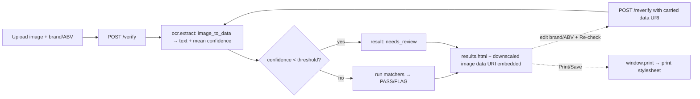

# feat: UI features for the label verification app

## Summary

Add four user-facing features to the existing single-screen verification app
without changing the matching rules or its stateless nature:

1. **Drag-and-drop upload + image preview** — a drop zone and a thumbnail of the
   label, both on the upload screen and on the results screen.
2. **Printable / downloadable result** — a print stylesheet + a "Print / Save"
   button so a verification can be kept as a compliance record.
3. **Inline edit & re-check** — edit the claimed brand/ABV on the results page and
   re-verify the *same* image without re-uploading.
4. **OCR-confidence "needs review" cue** — when Tesseract's confidence is below a
   single threshold, show "Low confidence — needs human review" instead of a hard
   verdict.

The app stays stateless (nothing persisted), must keep end-to-end verification
under 5 s, and must keep the existing 27 tests green.

---

## Problem Frame

The app today is a one-shot upload → verdict flow. For the low-tech compliance
agents it targets, three usability gaps remain: they can't see what they
uploaded, can't keep a record of a verdict, and must re-upload to fix a typo in
the claimed data. Separately, the binary PASS/FLAG hides the case the CEO review
flagged — a marginal OCR read that should ask for a human rather than guess.
These four features close those gaps while preserving the app's identity
(stateless, local, fast, simple).

---

## Requirements Traceability

- **R1** Drag-and-drop upload + label thumbnail on upload and results screens. → U1, U2
- **R2** Printable/savable result (print layout + button). → U3
- **R3** Inline edit of brand/ABV + re-check of the same image, no re-upload. → U2, U4
- **R4** "Needs review" state driven by a single OCR-confidence threshold. → U5, U6
- **R5** Stateless — no server-side storage of images or results. → U2 (data-URI carry)
- **R6** End-to-end verification (incl. confidence read) stays < 5 s. → U5
- **R7** Existing 27 tests remain green; new behavior gets its own tests. → all units

---

## Key Technical Decisions

- **Carry the uploaded image as an ephemeral base64 data URI, never stored.** To
  show the thumbnail on the results page and to re-check without re-upload, the
  server embeds a *downscaled* JPEG data URI of the label in the rendered results
  HTML. Nothing touches disk or a DB — the bytes live only in the response and the
  re-check request. Sample verifications use the existing static sample URL
  instead of a data URI. (Preserves R5.)
- **Bound the carried image size.** Downscale the preview/carry image to ≤1000 px
  long edge as JPEG (quality ~75) so the results HTML doesn't balloon on a large
  phone photo; re-check OCR runs on that already-bounded image.
- **One OCR pass yields text *and* confidence.** Replace the single
  `image_to_string` call with one `image_to_data` call and reconstruct both the
  line-preserving text and the mean word confidence from it — avoids a second OCR
  pass, protecting the <5 s budget (R6). If line reconstruction proves lossy for
  the strict warning check, fall back to `image_to_string` for text + a
  `image_to_data` pass for confidence (two passes, still well under budget).
- **"Needs review" is result-level, single-threshold.** A configurable
  `OCR_CONFIDENCE_THRESHOLD`; below it the result is `needs_review` and the UI
  shows the cue instead of PASS/FLAG. No per-field confidence, no calibration
  (fenced by scope-lock).
- **Print is client-side only.** A `@media print` stylesheet + `window.print()`;
  no server-side PDF dependency. Keeps the app dependency-light and stateless.
- **Minimal JS, progressive enhancement.** Drag-drop and preview are small vanilla
  JS on top of the existing `<input type=file>`; the form still works without JS.

---

## High-Level Technical Design

Stateless image carry + re-check (no storage at any step):

---

## Implementation Units

### U1. Drag-and-drop upload + client-side preview

**Goal:** A drop zone and an instant thumbnail of the chosen label on the upload
screen, with the form still working without JS.
**Requirements:** R1
**Dependencies:** none
**Files:** `app/templates/index.html`, `app/static/style.css`,
`app/static/upload.js` (NEW), `tests/test_web.py` (NEW)
**Approach:** Wrap the file input in a labeled drop zone; small vanilla JS handles
`dragover`/`drop` and sets the input's files, then renders an `` preview via
an object URL. No backend change. Progressive enhancement — without JS the plain
file input remains.
**Patterns to follow:** existing `.card`/`.field` styles and large-target sizing
in `app/static/style.css`.
**Test scenarios:**
- `GET /` returns 200 and includes the drop zone element and `upload.js`.
- Test expectation: drag/drop JS behavior itself is not unit-tested (no JS test
  harness in this POC); covered by manual browser check in Verification.
**Verification:** In a browser, dragging a file onto the zone shows a thumbnail
and submitting still verifies; with JS disabled the file input still works.

### U2. Label thumbnail on the results page (display-only data URI)

**Goal:** Show the verified label as a small thumbnail on the results page,
without storing it.
**Requirements:** R1, R5
**Dependencies:** none
**Files:** `app/main.py`, `app/templates/results.html`, `app/ocr.py` (reuse
`_prepare`/downscale), `tests/test_web.py`
**Approach:** In `/verify`, build a **small** (≤400 px long edge) JPEG base64 data
URI from the uploaded bytes for thumbnail display only — it is NOT used for
re-check (see U4), so it can be tiny, keeping the results HTML light. For
`/verify-sample/{key}`, pass the static sample URL instead. Nothing persisted.
**Technical design (directional):** a `to_thumbnail_data_uri(bytes) -> str|None`
helper: decode → downscale ≤400 px → JPEG q70 → `data:image/jpeg;base64,...`;
returns None on undecodable bytes (no thumbnail, page still renders).
**Test scenarios:**
- `POST /verify` with a sample image renders an `` whose `src` starts with
  `data:image/jpeg;base64,`.
- `POST /verify-sample/clean_pass` renders an `` pointing at the static
  sample path (not a data URI).
- The data URI round-trips: decoding it yields a valid image.
- A non-image upload still returns the friendly "couldn't read" page (no image).
**Verification:** Results page shows the label thumbnail for both upload and
sample flows; response contains no persisted file reference.

### U3. Printable / savable result

**Goal:** A clean print layout and a "Print / Save" button on the results page.
**Requirements:** R2
**Dependencies:** none
**Files:** `app/templates/results.html`, `app/static/style.css`
**Approach:** Add a `@media print` block hiding nav/buttons/raw-OCR `
`
and tightening the per-field cards to a printable report; add a "Print / Save"
button calling `window.print()`. "Save" = the browser's print-to-PDF.
**Test scenarios:**
- `POST /verify-sample/clean_pass` includes a print control and the page links the
  stylesheet (which contains an `@media print` rule).
- Test expectation: print rendering is visual — covered by manual check.
**Verification:** Print preview shows a clean one-page report (verdict + three
fields + thumbnail), no buttons or nav.

### U4. Inline edit & re-check (re-run matchers on carried OCR text)

**Goal:** Edit brand/ABV on the results page and re-verify with one click, no
re-upload — and with verdicts that stay consistent with the original read.
**Requirements:** R3
**Dependencies:** none
**Files:** `app/main.py` (new re-check route), `app/verify.py` (extract matcher
step), `app/templates/results.html`, `tests/test_web.py`
**Approach (per eng-review decision D2):** Re-check changes only the *claimed*
brand/ABV — the label image and its OCR text are unchanged — so re-check must NOT
re-OCR (re-OCR at a different resolution can flip a verdict on an untouched field).
Instead: carry the first pass's OCR text (`result.ocr_text`) in a hidden field
plus the editable brand/ABV; `POST /reverify` re-runs ONLY the three matchers
against that text with the new values. Extract a `verify_fields(text, brand,
alcohol_content, expected_warning) -> [FieldResult]` helper from `verify_label`
and reuse it in both paths (DRY) so re-check and first-pass share identical
matching logic.
**Technical design (directional):** `/reverify` accepts `brand`,
`alcohol_content`, and `ocr_text` (hidden); guards empty/missing text → friendly
"couldn't read" page; otherwise runs `verify_fields` and renders results. No OCR,
no image decode.
**Test scenarios:**
- `POST /reverify` with carried text + a corrected brand → results page with the
  updated brand verdict.
- Re-check carried text from `abv_mismatch` with the ABV corrected to the label's
  value → alcohol PASS.
- **Consistency guard:** `/reverify` with the SAME brand/ABV and carried text
  reproduces the original verdict exactly (proves no resolution-flip).
- `POST /reverify` with empty/missing `ocr_text` → friendly "couldn't read" page,
  not a 500.
- The re-check form pre-fills the current brand and ABV.
**Verification:** Editing the ABV on a flagged result and clicking re-check
re-renders an updated verdict instantly (no second OCR), and re-checking with
unchanged values yields the identical verdict.

### U5. OCR confidence + "needs review" state

**Goal:** Compute OCR confidence in the existing pass and mark marginal reads
`needs_review` below a single threshold.
**Requirements:** R4, R6
**Dependencies:** none
**Files:** `app/ocr.py`, `app/models.py`, `app/verify.py`, `app/config.py` (NEW or
inline constant), `tests/test_verify.py`
**Approach:** Change OCR to one `image_to_data` call; reconstruct line-preserving
text and compute mean word confidence (ignoring `-1`/empty). Add `confidence:
float` and `needs_review: bool` to `VerificationResult`. In `verify_label`, if the
image is readable but confidence < `OCR_CONFIDENCE_THRESHOLD`, return a
`needs_review` result (no field verdicts, or fields plus the flag — decide in
execution; default: surface the cue and still show fields). Keep latency < 5 s
(single OCR pass).
**Execution note:** Add a confidence test with a synthetic low-confidence image
before wiring the threshold, so the boundary is pinned by a test.
**Test scenarios:**
- A clean sample yields high confidence and `needs_review is False`; verdicts
  unchanged from today (regression guard for the 27 existing tests).
- A blurred/low-quality image yields confidence below the threshold →
  `needs_review is True`.
- `confidence` is populated (0–100) on readable results.
- An unreadable image still returns the friendly message (confidence path not
  reached).
- Reconstructed text still passes the existing matcher tests (warning whitespace,
  brand lines) — i.e., switching to `image_to_data` doesn't regress matching.
**Verification:** Clean samples behave exactly as before; a degraded image flips
to `needs_review`; `eval/run_eval.py` clean-case accuracy stays 100% and latency
stays < 5 s.

### U6. Surface "needs review" in the UI

**Goal:** Render the `needs_review` state clearly and distinctly from PASS/FLAG.
**Requirements:** R4
**Dependencies:** U5
**Files:** `app/templates/results.html`, `app/static/style.css`,
`tests/test_web.py`
**Approach:** Add an amber "Low confidence — needs human review" banner and styling
distinct from pass/flag; show the confidence value. Re-check (U4) and print (U3)
work in this state too.
**Test scenarios:**
- A `needs_review` result renders the amber banner and the confidence value.
- The banner is visually distinct from PASS (green) and FLAG (red).
**Verification:** A degraded upload shows the "needs review" banner; printing and
re-check still work from that state.

---

## Risks & Dependencies

- **Carried image size.** Full-resolution data URIs would bloat the results HTML.
  Mitigation: downscale to ≤1000 px JPEG before embedding (U2). Re-check OCR runs
  on the bounded image (acceptable; the upload OCR already downscales to 2000 px).
- **`image_to_data` text reconstruction regressing matching.** The strict warning
  check depends on line-preserving text. Mitigation: U5 test that the existing
  matcher suite still passes on reconstructed text; fallback to a two-pass OCR
  (string + data) if reconstruction is lossy — still < 5 s.
- **Confidence threshold calibration.** A single threshold is a coarse signal.
  Accepted per scope-lock (no calibration); make it a named constant so it's easy
  to tune, and document it.
- **Latency.** The confidence read must not add a second OCR pass on the hot path
  (U5 single-pass decision). Re-verify in `eval/run_eval.py` after U5.

---

## Scope Boundaries

### In scope
The six units above — all four features per the locked scope.

**Delivery sequencing (per eng-review decision D1):** two slices.
- **Slice 1 — UI (U1–U4):** drag-drop + preview, results thumbnail, printable
  result, inline re-check (matcher-only). Pure front-end + a stateless re-check
  route; no change to OCR or matching. Ships first.
- **Slice 2 — Confidence cue (U5–U6):** the `image_to_data` OCR-call change +
  `needs_review` state + UI. Isolated so its regression risk on the existing 27
  tests doesn't ride alongside the UI work.

### Deferred to follow-up work
- Batch upload + results table.
- Image-quality correction (deskew/glare/contrast).
- Per-field or calibrated confidence scoring beyond one threshold.
- Server-side PDF generation or stored verification history.

### Non-goals
- Persisting images or results server-side (stays stateless, no PII at rest).
- Auth/roles, COLA integration, cloud OCR.
- Changing the brand/ABV/warning matching rules.

---

## System-Wide Impact

- **`app/ocr.py`** changes its OCR call shape (string → data) — `extract_text`
  callers (`verify.py`) must keep working; the new `confidence` is additive.
- **`VerificationResult`** gains fields — `results.html` and any code reading the
  model must tolerate the new `needs_review`/`confidence` (additive, defaulted).
- **New routes** (`/reverify`) and a new static asset (`upload.js`) — keep them out
  of the Docker image's ignore list so deploy includes them.

---

## Sources & Research

- Locked scope: scope-lock output (this session).
- Existing code: `app/main.py`, `app/ocr.py`, `app/verify.py`, `app/models.py`,
  `app/matching.py`, `app/templates/`, `app/static/style.css`.
- Prior CEO review (deferred "needs review" abstention idea), this session.

---

## GSTACK REVIEW REPORT

| Review | Trigger | Why | Runs | Status | Findings |
|--------|---------|-----|------|--------|----------|
| Eng Review | `/plan-eng-review` | Architecture & tests (required) | 1 | CLEAR | 2 issues, 0 critical gaps |
| CEO Review | `/plan-ceo-review` | Scope & strategy | 0 | — | — |
| Design Review | `/plan-design-review` | UI/UX gaps | 0 | — | — |

**Decisions resolved:**
- **D1 (scope):** Split into two slices — UI features (U1–U4) ship first; the
  confidence cue (U5–U6, the `image_to_data` OCR-call change) is Slice 2, isolating
  its regression risk from the UI work.
- **D2 (architecture):** Inline re-check re-runs the matchers on the carried OCR
  text (via an extracted `verify_fields` helper), not a second OCR pass. Kills a
  resolution-inconsistency bug that could flip an untouched field's verdict, makes
  re-check instant, and lets the thumbnail be a small display-only data URI.

**Test coverage (Slice 1):** re-check route gets unit tests incl. a consistency
guard (unchanged inputs → identical verdict) and an empty-carried-text guard;
thumbnail render tested; drag-drop + print are manual-only (no JS test harness in
this POC — flagged, acceptable). No matching/OCR regressions in Slice 1 (those
land in Slice 2, where the plan already mandates a regression test that the 27
existing tests stay green on reconstructed `image_to_data` text).

**Failure modes:** 0 critical gaps. Re-check on empty/missing carried text →
friendly message (tested). Undecodable upload → no thumbnail, page still renders.

**Performance:** Re-check is matcher-only (no 2nd OCR, instant); thumbnail ≤400 px
keeps results HTML light; no DB, no N+1.

**Parallelization:** Sequential — Slice 1 then Slice 2; within Slice 1, U4 depends
on the `verify_fields` extraction. Single primary module surface (`app/`), low
parallelization value.

**UNRESOLVED:** none.

**VERDICT:** ENG CLEARED — ready to implement (Slice 1 first). Note:
`gstack-review-log` could not be written (binary perms, exit 126), so the /ship
dashboard won't show this run; the report here is authoritative.
