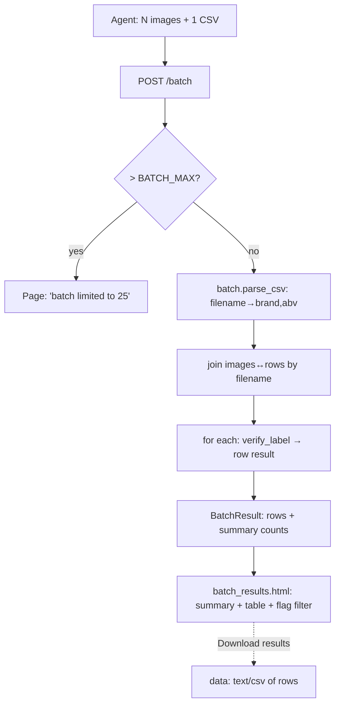

# feat: Batch label verification

## Summary

Add a second entry point that verifies up to ~25 labels in one request. The agent
uploads N label images plus one CSV mapping `filename → brand, alcohol_content`;
the app verifies each label through the existing `verify_label` pipeline and
renders a results table with per-label PASS / FLAG / NEEDS-REVIEW / couldn't-read,
summary counts, and a filter to show only rows needing attention. The app stays
stateless (nothing stored), keeps <5s per label, and the existing 40 tests stay
green. Should-have: download the results as a CSV, and a downloadable CSV template.

---

## Problem Frame

The tool today verifies one label at a time. The real TTB workflow is a *queue* of
~150k applications/year; an agent wants to clear a stack, not click through one at
a time. Batch verification turns the tool from a single-label novelty into
something that triages a pile and surfaces only the labels that need human eyes —
the "show me only the flags" workflow the CEO review called out. Bounded to ~25
synchronously here; the 200-300 async target stays deferred.

---

## Requirements Traceability

- **R1** Batch screen: multi-image upload + CSV upload, alongside the single-label screen. → U2
- **R2** Parse CSV (`filename, brand, alcohol_content`); join each image to its row by filename. → U1
- **R3** Verify each label via the existing `verify_label`; one result per row. → U1
- **R4** Results table: row per label — field verdicts + overall outcome. → U2
- **R5** Summary counts (pass / flag / needs-review / error). → U1, U2
- **R6** Filter to show only rows needing attention. → U2
- **R7** Per-row error handling, never a 500 (no image, no CSV row, undecodable image, bad CSV). → U1, U2
- **R8** Batch cap (~25): a clear message if exceeded, not a 2-minute hang. → U1, U2
- **R9** Stateless — no server-side storage of images, CSV, or results. → U1, U2
- **R10** Existing 40 tests stay green; batch gets its own tests. → all units
- **R11** (should) Download results as a CSV. → U3
- **R12** (should) Downloadable CSV template. → U3

---

## Key Technical Decisions

- **Batch core is a pure, web-free module.** `app/batch.py` takes parsed CSV rows
  + named image bytes and returns a structured `BatchResult` (rows + summary),
  reusing `verify_label` per label. This keeps the orchestration unit-testable
  without HTTP and mirrors how `verify.py` is structured.
- **Join by filename, case-insensitive basename.** The CSV `filename` column is
  matched to each upload's basename, lowercased. Unmatched on either side becomes
  an explicit error row (R7), not a silent drop.
- **Bounded synchronous, cap = 25.** A `BATCH_MAX_LABELS` constant. Over the cap →
  a clear message before any OCR runs. On Render Starter (~0.7s/label) a full batch
  is ~15-20s — acceptable synchronously for a POC; async/streaming for 200-300 is
  explicitly deferred.
- **Stateless throughout.** Images/CSV are read from the request and discarded;
  results live only in the rendered page. The results-CSV export (U3) is generated
  at render time and offered as a `data:` download — no storage, no re-run.
- **Filter is client-side.** A checkbox toggles a CSS class that hides PASS rows;
  progressive enhancement, works without JS (all rows just show).
- **stdlib `csv` only.** No new dependency; tolerate a BOM, surrounding
  whitespace, and a header row; missing required columns → friendly error.

---

## High-Level Technical Design

---

## Implementation Units

### U1. Batch core: CSV parse + per-label orchestration

**Goal:** A web-free module that turns (CSV bytes, named image bytes, cap) into a
structured batch result, reusing the existing verifier.
**Requirements:** R2, R3, R5, R7, R8, R9
**Dependencies:** none
**Files:** `app/batch.py` (NEW), `app/models.py` (add batch result types),
`tests/test_batch.py` (NEW)
**Approach:** `parse_csv(data: bytes) -> dict[str, ClaimedRow]` keyed by lowercased
filename; tolerant of BOM/whitespace/header; raises a clear error on missing
columns. **A filename that appears more than once in the CSV is flagged as a
duplicate (eng-review D2) — never silently pick a row**, since verifying against
the wrong claimed data would produce a trusted-but-bogus verdict. `run_batch(images:
list[(name, bytes)], rows: dict, cap) -> BatchResult`: enforce cap; for each image,
look up its row and call `verify_label`; build a `BatchRow(filename, status, fields,
error)` where status ∈ {pass, flag, needs_review, unreadable, no_application_data,
duplicate_application_data}; add error rows for CSV entries with no image. Summary
counts derived from rows.
**Technical design (directional):** `BatchRow` wraps the per-label outcome +
filename + a status enum derived from the `VerificationResult`
(`needs_review` → needs_review; not readable → unreadable; overall_pass → pass;
else flag). `BatchResult` = `rows: list[BatchRow]` + `summary: dict[str,int]`.
**Execution note:** Build this test-first — the join/edge-case matrix is the risk.
**Test scenarios:**
- 3 images + matching CSV rows → 3 rows with correct statuses (pass/flag/needs).
- Image with no CSV row → row status `no_application_data`, no crash.
- CSV row with no image → an error row flagged for that filename.
- Undecodable image bytes → row status `unreadable` (friendly), not an exception.
- CSV missing the `brand` column → `parse_csv` raises a clear error.
- CSV with BOM + extra whitespace + header → parses correctly.
- Same filename in two CSV rows → that label gets status `duplicate_application_data`
  and is NOT verified against a guessed row (eng-review D2).
- Over the cap (cap+1 images) → run_batch returns a capped error result without OCR.
- Summary counts equal the per-row tally.
**Verification:** `run_batch` returns correct rows + summary for a mixed batch;
every error path yields a row/result, never an exception.

### U2. Batch web flow: upload screen, results table, filter

**Goal:** The user-facing batch screen and results table wired to U1.
**Requirements:** R1, R4, R5, R6, R7, R8, R9
**Dependencies:** U1
**Files:** `app/main.py` (GET /batch, POST /batch), `app/templates/batch.html`
(NEW), `app/templates/batch_results.html` (NEW), `app/static/style.css`,
`app/static/batch.js` (NEW — filter toggle), `app/templates/index.html` (link to
batch), `tests/test_web.py`
**Approach:** `GET /batch` renders the upload form (multi-file image input + CSV
input + the cap stated, plus a "verifying up to N labels can take ~20s — please
wait" note so a low-tech agent doesn't think the ~18s synchronous request hung and
re-submit it, eng-review D1). `POST /batch` reads `images: list[UploadFile]` + the
CSV `UploadFile`, calls `batch.run_batch`, and renders `batch_results.html`: a summary
banner with counts, a table (filename, three field verdicts, overall status badge),
and a "show only rows needing attention" checkbox (client-side filter via
`batch.js`). Reuse existing badge/banner CSS. Link to /batch from the home screen.
**Patterns to follow:** `app/main.py` route + `_render_result` style;
`app/static/upload.js` for the small progressive-enhancement JS; existing
`.badge`/`.banner` styles.
**Test scenarios:**
- `GET /batch` returns 200 with both file inputs and the cap text.
- `POST /batch` with 3 sample images + a CSV → table with 3 rows + summary counts.
- Mixed batch (one flagged, one needs-review via a blurred image, one pass) → the
  summary reflects each bucket.
- `POST /batch` with a malformed CSV → friendly error page, not a 500.
- `POST /batch` over the cap → the cap message, status 200, no table.
- The results page includes the filter control and a `needs-attention` marker on
  non-pass rows.
**Verification:** Uploading sample images + CSV in a browser yields a correct
table; the filter hides PASS rows; bad inputs show clear messages.

### U3. Results-CSV export + CSV template (should-have)

**Goal:** Let the agent download the batch verdicts and grab a correctly-formatted
template.
**Requirements:** R11, R12
**Dependencies:** U1, U2
**Files:** `app/batch.py` (results→CSV helper), `app/templates/batch_results.html`
(download link), `app/templates/batch.html` (template link),
`app/static/batch-template.csv` (NEW), `tests/test_batch.py`
**Approach:** A `results_to_csv(BatchResult) -> str` helper (filename, brand
verdict, alcohol verdict, warning verdict, overall). The results page offers it as
a `data:text/csv;base64,...` download link generated at render (stateless, no
re-run). Ship a static `batch-template.csv` with the header + one example row,
linked from the batch upload screen.
**Test scenarios:**
- `results_to_csv` emits a header + one row per result with the right columns.
- The static template parses cleanly through `parse_csv` (round-trip).
**Verification:** The results page download yields a CSV matching the table; the
template downloads and is accepted by the batch upload.

---

## Risks & Dependencies

- **Synchronous latency on a full batch.** 25 labels × ~0.7s ≈ 18s on Starter —
  within HTTP timeout but slow. Mitigation: the cap; stated up front; async
  deferred. Re-check end-to-end timing after U2.
- **Memory: N images in one request.** 25 phone photos could be tens of MB in
  memory at once. Mitigation: the cap bounds it; images are processed and released
  per-label (don't hold decoded copies). Note for execution.
- **CSV format fragility.** Users will send messy CSVs. Mitigation: tolerant parse
  (BOM/whitespace/header), explicit errors, and the downloadable template (U3).
- **Filename collisions / path components in CSV.** The CSV filename is used ONLY
  as a join key (basename, lowercased) — never to open a file — so a path like
  `../../etc/passwd` is harmless (it just won't match an upload). Duplicate
  filenames become an explicit `duplicate_application_data` error row, not a silent
  guess (eng-review D2).

---

## Scope Boundaries

### In scope
The three units above — bounded synchronous batch (images + CSV), results table +
filter, and the should-have export/template.

### Deferred to follow-up work
- 200-300 scale via async background jobs + a progress UI (the creep magnet).
- Persisting batches / verification history; per-row drill-down to the single-label
  detail view; image-quality correction.

### Non-goals
- Server-side storage of images, CSVs, or results (stateless, no PII at rest).
- Async/streaming/job-queue processing; auth/roles; COLA; changing matching rules.

---

## System-Wide Impact

- **Additive only.** New routes (`/batch`), new module (`app/batch.py`), new
  templates/static — the single-label flow is untouched. `verify_label` is reused
  read-only.
- **New static assets** (`batch.js`, `batch-template.csv`) live under `app/` so the
  Dockerfile copies them; no Docker/.dockerignore change needed (tests/eval/docs
  stay excluded).
- **`list[UploadFile]`** relies on `python-multipart` (already a dependency).

---

## Sources & Research

- Locked scope: scope-lock output (this session).
- Existing code: `app/verify.py` (`verify_label`), `app/models.py`,
  `app/main.py` routes + `_render_result`, `app/static/upload.js`, `app/static/style.css`.
- PVD parking lot: batch upload of 200-300 applications (the async target, deferred).

---

## GSTACK REVIEW REPORT

| Review | Trigger | Why | Runs | Status | Findings |
|--------|---------|-----|------|--------|----------|
| Eng Review | `/plan-eng-review` | Architecture & tests (required) | 1 | CLEAR | 2 issues, 0 critical gaps |
| CEO Review | `/plan-ceo-review` | Scope & strategy | 0 | — | — |
| Design Review | `/plan-design-review` | UI/UX gaps | 0 | — | — |

**Decisions resolved:**
- **D1 (scope):** Build all three units — core batch (U1+U2) plus the results-CSV
  export and CSV template (U3). The export is the compliance artifact agents want
  and is cheap to build; completeness over a marginally smaller diff.
- **D2 (correctness):** A filename duplicated in the CSV becomes an explicit
  `duplicate_application_data` error row — never a silent guess, which would verify
  a label against the wrong claimed data and produce a trusted-but-bogus verdict.

**Accepted as-is (noted, not blocking):** the batch runs synchronously (~18s for a
full 25 on Starter) with no progress bar; mitigated by the cap + a "please wait"
note on the batch screen (folded into U2). True async/progress for the 200-300
target stays deferred.

**Test coverage:** U1's join/edge matrix is the risk surface and is well covered
(image-without-row, row-without-image, duplicate filename, undecodable image,
malformed/BOM CSV, over-cap, summary tally) — built test-first per the execution
note. U2 covers the routes + malformed CSV + cap + filter. No regressions (the
single-label flow and `verify_label` are reused read-only; existing 40 tests stay
green). Export/template get a CSV round-trip test.

**Failure modes:** 0 critical gaps. Every batch error path yields a row/result, not
an exception (no 500): no row, no image, duplicate, unreadable, bad CSV, over-cap.

**Performance:** Sequential per-label OCR is correct on a 0.5-CPU instance
(parallelizing CPU-bound OCR there buys nothing); memory bounded by the ~25 cap;
no DB / no N+1.

**Parallelization:** U1 (batch core) → U2 (web) → U3 (export) are dependency-ordered
on a single `app/` surface — sequential implementation, no worktree split.

**UNRESOLVED:** none.

**VERDICT:** ENG CLEARED — ready to implement. (`gstack-review-log` not written —
binary perms, exit 126; this report is authoritative.)
