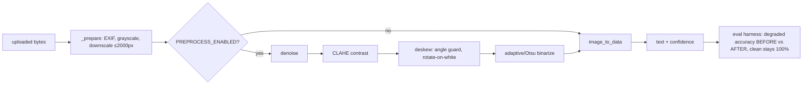

# feat: OpenCV image preprocessing before OCR

## Summary

Insert an OpenCV preprocessing stage before Tesseract — grayscale → denoise →
CLAHE contrast-normalize → deskew → adaptive/Otsu binarize — to raise real-photo
end-to-end accuracy (currently ~57% on the degraded eval set) without regressing
clean-label logic accuracy (100%) or the <5s/label budget. The eval harness is the
before/after scoreboard: a change ships only if it raises degraded-set accuracy and
keeps clean cases perfect. A `PREPROCESS_ENABLED` constant lets a regressing pipeline
be turned off, and OpenCV's Docker and latency risks are verified first, not at
deploy time.

---

## Problem Frame

The tool's decision logic is solid (100% on clean text), but real photos OCR
poorly: the eval's degraded cases (rotation, blur, JPEG, low contrast) miss the
strict warning because Tesseract reads the mangled text wrong. Brand/ABV survive;
the warning doesn't. The CEO review flagged this as the #1 risk. Preprocessing
attacks the input quality before OCR — the highest-leverage lever left — and the
eval already quantifies it, so progress is measurable.

---

## Requirements Traceability

- **R1** OpenCV preprocessing pipeline (denoise, contrast, deskew, binarize) runs before OCR. → U2, U3
- **R2** A `PREPROCESS_ENABLED` on/off constant. → U3
- **R3** Eval shows degraded-set end-to-end accuracy HIGHER than the current ~57% (or no worse). → U4
- **R4** Clean-case logic accuracy stays 100% (no regression). → U3, U4
- **R5** <5s per label maintained (preprocessing adds CPU). → U1, U4
- **R6** Docker image still builds + deploys with OpenCV. → U1
- **R7** No change to matching rules or the web UI. → all units (constraint)
- **R8** Add 1–2 genuinely degraded/real photos to the eval set. → U4

---

## Key Technical Decisions

- **opencv-python-headless** (not `opencv-python`) — no GUI libraries, smaller
  image. It still needs a couple of system libs at runtime (`libglib2.0-0`, and
  sometimes `libgl1`); **U1 verifies the Docker build before any pipeline work**.
- **Pipeline order:** grayscale → light denoise → CLAHE (local contrast) → deskew
  → adaptive/Otsu binarize, applied after the existing ≤2000px downscale in the
  OCR path. Tesseract reads cleaner, higher-contrast, straightened text better.
- **Deskew must be safe on already-straight images.** Detect the text angle (min-
  area-rect of the foreground mask); if `|angle|` is below a small threshold or
  detection is unreliable, skip rotation — a clean label must not be mis-rotated.
  Rotate on a white background to avoid black borders confusing OCR.
- **Eval gates every step.** Each preprocessing step stays only if the eval shows
  it helps the degraded set without dropping clean accuracy. Any regressing step
  is tuned or dropped — no step is sacred (this is the rabbit-hole guard).
- **Per-step toggles, not one master flag (eng-review D1).** Each step
  (`denoise`, `contrast`, `deskew`, `binarize`) has its own enable flag plus a
  master `PREPROCESS_ENABLED`. The eval can then *ablate* — turn each step off
  independently — so when a regression shows up you can see WHICH step caused it
  (deskew is the prime suspect) and drop just that one. A single flag can't make
  the "drop the regressing step" guard executable; per-step toggles can.
- **Pass the processed array straight to pytesseract** (it accepts a NumPy ndarray)
  — no extra PIL round-trip.
- **Latency budget is real on 0.5 CPU.** Denoise is the heaviest step; keep it
  light (or drop it) if U1's latency probe shows the pipeline approaching the
  budget. Measured, not assumed.

---

## High-Level Technical Design

---

## Implementation Units

### U1. Add OpenCV + verify Docker build and latency (de-risk first)

**Goal:** Prove OpenCV installs, imports, builds in Docker, and that a preprocessing
pass fits the latency budget — before building the pipeline on top of it.
**Requirements:** R5, R6
**Dependencies:** none
**Files:** `requirements.txt`, `Dockerfile`
**Approach:** Add `opencv-python-headless` to requirements. Confirm it imports in
the venv. Add the runtime system libs it needs to the Dockerfile apt line
(`libglib2.0-0`, plus `libgl1` if import fails without it) and confirm the image
builds. Run a throwaway timing probe: a representative OpenCV pipeline
(denoise+CLAHE+deskew+threshold) on a ~2000px sample, to estimate the per-label
overhead and confirm headroom under 5s (account for the 0.5-CPU Starter being
~slower than local).
**Execution note:** This is the de-risk gate — if OpenCV can't build in Docker or
blows the latency budget, surface it now and reconsider scope before U2.
**Test scenarios:** Test expectation: none — dependency/infra. Verified by
`import cv2` succeeding and a documented latency number from the probe.
**Verification:** `cv2` imports locally; Docker image builds with OpenCV; the probe
shows preprocessing overhead leaves comfortable room under 5s.

### U2. Preprocessing pipeline module

**Goal:** A focused, testable OpenCV preprocessing function (and its steps).
**Requirements:** R1
**Dependencies:** U1
**Files:** `app/preprocess.py` (NEW), `tests/test_preprocess.py` (NEW)
**Approach:** `preprocess(gray: ndarray) -> ndarray` composing: light denoise
(e.g. `fastNlMeansDenoising` with small params, or bilateral), CLAHE contrast,
`deskew(gray) -> (rotated, angle)` (foreground mask → min-area-rect angle → rotate
on white only when `|angle|` exceeds a guard), then adaptive/Otsu threshold. Each
step is its own function so it's independently testable and droppable. No web or
OCR dependency here.
**Execution note:** Test-first — deskew is the risky step; pin its behavior with a
known-rotation fixture before wiring it in.
**Test scenarios:**
- `deskew` on an image rotated by a known +10° returns an angle estimate near -10°
  and a visibly straightened result (assert detected angle within a tolerance).
- `deskew` on an already-straight image returns ~0° and leaves it essentially
  unchanged (no spurious rotation — the clean-image guard).
- Binarize output is 2-valued (or near it) and preserves the text region (non-blank).
- `preprocess` on a clean sample returns an image Tesseract still reads (sanity).
**Verification:** Each step runs on a sample without error; deskew corrects a known
rotation and is a near-noop on a straight image.

### U3. Wire preprocessing into the OCR path (gated, regression-guarded)

**Goal:** Run the pipeline before `image_to_data`, behind `PREPROCESS_ENABLED`,
without regressing clean verdicts.
**Requirements:** R1, R2, R4, R7
**Dependencies:** U2
**Files:** `app/ocr.py`, `tests/test_verify.py`
**Approach:** In the OCR path (after `_prepare`'s grayscale/downscale, before
`image_to_data`), if `PREPROCESS_ENABLED`, convert the PIL image to a NumPy array,
run `preprocess` (which applies only the steps whose per-step toggle is on, per
D1), and feed the result to `image_to_data`. Add the master `PREPROCESS_ENABLED`
plus the per-step flags. Matching rules and the web layer are untouched (R7).
**Test scenarios:**
- Covers regression: each clean sample (`clean_pass`, `abv_mismatch`, `bad_warning`)
  still produces the SAME per-field verdicts as before preprocessing (R4).
- A clean sample's confidence stays above the needs-review threshold (no spurious
  "needs review" introduced by binarization).
- With `PREPROCESS_ENABLED = False`, behavior is identical to today (toggle works).
**Verification:** Full existing suite stays green; clean verdicts and confidence
unchanged with preprocessing on.

### U4. Eval scoreboard: degraded/real cases + before/after measurement

**Goal:** Prove the lift — degraded-set accuracy up, clean still 100%, latency OK.
**Requirements:** R3, R4, R5, R8
**Dependencies:** U3
**Files:** `eval/cases.py`, `eval/run_eval.py`, `eval/images/` (NEW degraded/real),
`eval/REPORT.md` (generated)
**Approach:** Add 1–2 harder cases (a heavier degraded variant and/or a real
public-domain label photo) to the eval set. Run the eval BOTH with preprocessing
off and on **in the same pass** and record the end-to-end accuracy delta + max
latency in one report (don't rely on the drifting committed ~57% number). Use the
per-step toggles (D1) to **ablate** if the net result regresses — measure each
step's individual effect to find and drop the culprit. The gate: AFTER ≥ BEFORE on
degraded, clean = 100%, max latency < 5s.
**Execution note:** This unit is the decision gate for the whole feature — if the
numbers don't move (or clean regresses), tune/drop steps in U2/U3 rather than ship.
**Test scenarios:**
- Eval runs end-to-end and emits both a logic-on-clean number (must be 100%) and an
  end-to-end number.
- A latency assertion: every eval case completes < 5000 ms with preprocessing on.
- (Measurement, not pass/fail) the degraded end-to-end accuracy with preprocessing
  on is recorded and compared to the ~57% baseline.
**Verification:** `eval/REPORT.md` shows clean = 100%, degraded end-to-end ≥ the
~57% baseline, and max latency < 5s, with preprocessing on.

---

## Risks & Dependencies

- **Deskew mis-rotating a clean/sparse image → HURTS accuracy.** Mitigation: the
  angle guard (skip small/uncertain angles) + the eval gate; drop deskew if it
  regresses clean cases.
- **Latency on 0.5 CPU.** Denoise + deskew + threshold on a 2000px image adds CPU.
  Mitigation: U1 measures it first; keep denoise light or drop it; the existing
  downscale bounds the pixel count. U4 asserts < 5s.
- **OpenCV Docker deps.** `opencv-python-headless` still needs `libglib2.0-0`
  (maybe `libgl1`). Mitigation: U1 verifies the Docker build before pipeline work.
- **Binarization erasing faint text → worse OCR.** Mitigation: adaptive threshold
  for uneven lighting; the eval gate catches a net regression.
- **Build/image size.** OpenCV adds tens of MB to the image and build time.
  Accepted; headless keeps it as small as practical.

---

## Scope Boundaries

### In scope
The four units — one OpenCV preprocessing pipeline, gated and eval-proven.

### Deferred to follow-up work
- Per-image adaptive "only preprocess if the image looks degraded" decision.
- ML/super-resolution enhancement; a pluggable cloud-vision OCR backend.

### Non-goals
- Changing the matching rules; the web UI flows; storage; external APIs.

---

## System-Wide Impact

- **OCR path only.** The change lives in the OCR stage (`app/ocr.py` + a new
  `app/preprocess.py`); `verify_label`, matching, and the web layer are unchanged.
- **New dependency** (`opencv-python-headless`) + Dockerfile system libs — the only
  cross-cutting surface; verified in U1.
- **Eval artifacts** update (`eval/REPORT.md`, new images) — these are the proof,
  not runtime behavior.

---

## Sources & Research

- Locked scope: scope-lock output (this session). External research skipped —
  OpenCV is the user's named, settled choice; planned from direct knowledge.
- Existing code: `app/ocr.py` (`_prepare`, `extract_text_data`, `_TESS_CONFIG`,
  confidence threshold), `eval/run_eval.py` + `eval/cases.py` (the scoreboard),
  `Dockerfile` (apt line), `requirements.txt`.
- Prior CEO review: real-photo OCR accuracy flagged as the #1 risk (this session).

---

## GSTACK REVIEW REPORT

| Review | Trigger | Why | Runs | Status | Findings |
|--------|---------|-----|------|--------|----------|
| Eng Review | `/plan-eng-review` | Architecture & tests (required) | 1 | CLEAR | 1 issue, 0 critical gaps |
| CEO Review | `/plan-ceo-review` | Scope & strategy | 0 | — | — |
| Design Review | `/plan-design-review` | UI/UX gaps | 0 | — | — |

**Decision resolved:**
- **D1 (architecture):** Per-step preprocessing toggles (denoise / contrast /
  deskew / binarize) plus the master switch — not one flag. Makes the plan's "drop
  the regressing step" guard executable: the eval can ablate each step to find the
  culprit (deskew is the prime suspect) instead of ripping the whole pipeline out.

**Eval-method tightened:** U4 now runs preprocessing OFF vs ON in the same pass for
a clean delta (not against the drifting committed ~57% number).

**Test coverage:** strong — deskew known-rotation + straight-image no-op (the risky
step, test-first), binarize preserves text, and the IRON regression guard (clean
samples' verdicts unchanged after the image_to_data→preprocessed switch). U4 is the
decision gate: degraded accuracy up, clean 100%, latency <5s.

**Failure modes:** 0 critical gaps. The two real risks — deskew mis-rotating a clean
image, and OpenCV latency on 0.5 CPU — both have a test/guard (angle guard + eval
gate; U1 latency probe + U4 <5s assertion) and are visible, not silent.

**Performance:** the de-risk unit (U1) measures OpenCV's added latency on a
representative image BEFORE building the pipeline; per-step toggles also let denoise
(the heaviest step) be dropped if it's the latency hog.

**Architecture note (boring-by-default):** OpenCV is a real innovation-token spend,
but it's the right one for deskew/binarize and is well-bounded (headless, gated, the
OCR stage only). U1 verifies the Docker build before any pipeline work.

**Parallelization:** U1 → U2 → U3 → U4 are strictly dependency-ordered on the OCR
stage — sequential, no worktree split.

**UNRESOLVED:** none.

**VERDICT:** ENG CLEARED — ready to implement. (`gstack-review-log` not written —
binary perms, exit 126; this report is authoritative.)
