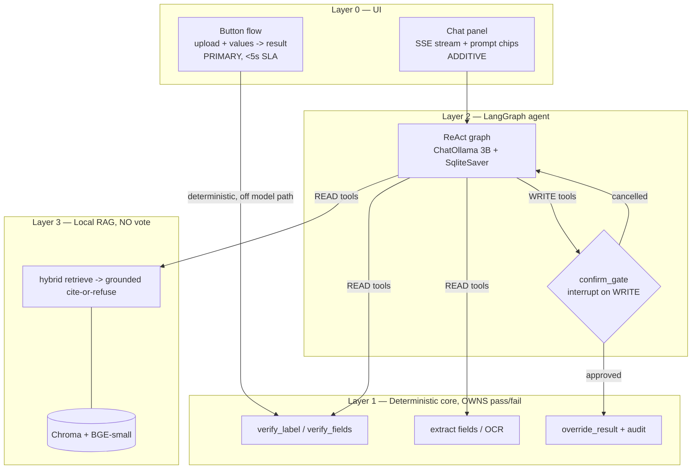
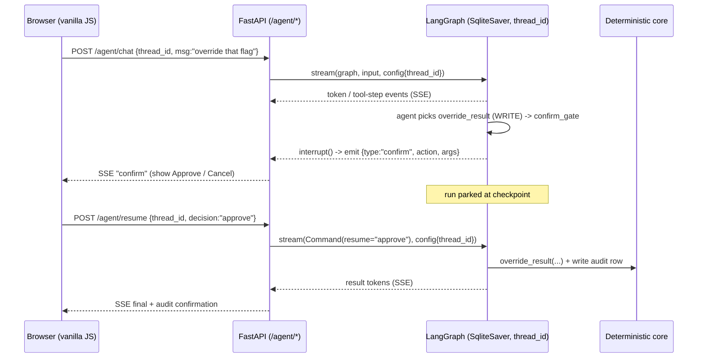

# feat: Conversational LangGraph agent + local RAG knowledge layer

## Summary

Add two new layers on top of the existing deterministic TTB label-verification
core: (2) a **LangGraph conversational agent** that drives every core feature
through tools, with a human-in-the-loop confirm gate on writes; and (3) a **local
RAG knowledge layer** that grounds regulatory Q&A and flag explanations in 27 CFR
with citations. Everything runs **fully offline** (local Ollama, local
sentence-transformers, local Chroma). The LLM **orchestrates and explains but
never adjudicates** — the deterministic core owns every pass/fail, RAG cites or
refuses, and a human commits every write. The existing button UI stays the
primary, always-available, `<5 s` path; chat is additive.

This plan builds the **must-have vertical** (slices A→B→C→E) that proves the
three-layer architecture end to end, with should-have tools (slice D) sequenced
after. Build incrementally; each slice is independently demoable.

---

## Problem Frame

The deterministic verification core (Layer 1) already exists and is proven
(`app/verify.py`, `app/ocr.py`, `app/matching.py`, `app/batch.py`, 89 tests,
`<5 s`, deployed). What's missing is a **conversational surface** that lets a
low-tech compliance agent *talk to* the tool ("verify the uploaded label",
"why did this flag?", "what does a wine label need?", "override that one") and a
**regulatory knowledge layer** that answers with citations instead of
hallucinated compliance text. The hard parts are not the chat veneer — they are:

1. Keeping the LLM strictly off every verdict (tools adjudicate; LLM narrates).
2. Running a real model **offline** on a constrained host without breaking the
   `<5 s` verification SLA (the prior 30–40 s vendor tool was abandoned).
3. A **citation-grounded, refuse-if-unknown** RAG layer — hallucinated
   regulation is the one failure mode that cannot ship.
4. A **human-gated** write path (`interrupt()`/resume) that works across
   stateless HTTP, with an audit trail.

---

## Requirements (traceability)

Carried from the master brief; each maps to units below.

- **R1 — Single source of truth.** Agent tools *wrap* existing core functions; no
  second verdict path. (U2, U4)
- **R2 — LLM never adjudicates.** Pass/fail comes only from deterministic tool
  results; the system prompt + graph forbid the model deciding. (U2, U8)
- **R3 — `<5 s` verification incl. cold start**, measured on the deterministic
  path; RAG/chat are off the hot path. (U2, U7, U10)
- **R4 — Fully offline.** No outbound calls at runtime (OCR, embeddings, LLM,
  vector store all local). Corpus fetched at *build* time, cached, baked in. (U1, U6, U11)
- **R5 — Human-gated writes + audit.** Every write/override pauses at the confirm
  gate and is audit-logged; the agent can never auto-approve. (U4, U5)
- **R6 — Citation-required, refuse-if-unknown** on all regulatory output. (U8)
- **R7 — Two matching strategies stay separate** (fuzzy brand/ABV; strict §16.21
  warning + ALL-CAPS header) — inherited unchanged from the core. (U2)
- **R8 — Button UI stays primary/always-available**; chat is additive. (U3)
- **R9 — Streaming with visible tool steps** + guided prompt chips for low-tech
  users. (U3)

---

## Key Technical Decisions

| # | Decision | Rationale |
|---|----------|-----------|
| KTD1 | **Tools wrap, never reimplement.** Each tool calls an existing `app/` function and returns its result verbatim. | Guarantees button-parity (R1) and keeps the verdict deterministic (R2). |
| KTD2 | **Verdict core unchanged (brand/ABV/warning).** `extract_label_fields` returns those 3 structured + best-effort raw for the rest; `validate_class_type` takes the claimed designation as input, advisory only. | Protects the proven `<5 s` core; extra fields gate no verdict (locked Q3). |
| KTD3 | **3B local model via Ollama** (`llama3.2:3b` or `qwen2.5:3b-instruct`), BGE-small embeddings, Chroma — on one ~4 GB always-on host. | Smallest footprint that honors offline+deployed; exact model pending a host spike (locked Q1). |
| KTD4 | **SLA is measured on the deterministic verify path, not end-to-end chat.** Verify is a single tool call off the model path; the button route remains the SLA guarantee. Chat latency is hidden by streaming. | The brief's `<5 s` is a property of *verification*, not of LLM token generation (R3). |
| KTD5 | **Corpus is build-time fetched, runtime-cached.** eCFR Part 16 + Part 4 are downloaded once during an ingestion build step, chunked with citation metadata, and the built Chroma index + raw source are committed/baked into the image. | Runtime stays fully offline (R4); re-ingestible when regs change. |
| KTD6 | **Hybrid retrieval (BM25 + dense), cite-or-refuse generation.** Regulatory queries are term-heavy ("type size", "750 mL", section numbers); dense alone misses them. Generation answers only from retrieved chunks and refuses below a confidence threshold. | Retrieval quality + no hallucinated compliance text (R6). |
| KTD7 | **`interrupt()`/resume over HTTP via `thread_id` + `SqliteSaver`.** `/agent/chat` (SSE) runs until `interrupt()`, emits a `confirm` event, parks at the checkpoint; `/agent/resume` continues the same run via `Command(resume=...)`. | The only correct way to pause-for-human across stateless requests (R5, locked Q4). |
| KTD8 | **Vanilla JS + SSE, no build step.** A small `EventSource`-driven chat panel + static prompt chips, consistent with the existing server-rendered, no-JS-build UI. | Honors R8/R9 without adding a React toolchain (locked Q4). |
| KTD9 | **Citation metadata IS the citation.** Chunks carry `{part, section, paragraph, source_url, effective_date, beverage_type}`; the answer renders the controlling rule from metadata, never from model memory. | Auditable, verifiable citations (R6). |

---

## High-Level Technical Design

### Three layers + request flow



### One chat turn with a human-gated write (`interrupt`/resume)



*Directional guidance — the prose and unit fields are authoritative.*

---

## Output Structure

New packages alongside the existing `app/`. The deterministic core in `app/`
is reused unchanged (except a thin best-effort `extract_label_fields` wrapper and
the audit table).

```
agent/
  __init__.py
  state.py          # AgentState (messages + anchors)
  llm.py            # ChatOllama factory (model from config)
  tools.py          # tool defs: READ (verify_label, regulatory_lookup, explain_flag) / WRITE (override_result)
  graph.py          # build_graph(): ReAct loop + confirm_gate + checkpointer
  confirm.py        # confirm_gate node + interrupt payload shape
  audit.py          # append-only SQLite audit log
  config.py         # model name, db paths, thresholds, offline guard
rag/
  __init__.py
  ingest.py         # fetch (build-time) + structure-aware chunk + metadata
  store.py          # Chroma + sentence-transformers (BGE-small)
  retrieve.py       # hybrid BM25 + dense fusion
  generate.py       # grounded cite-or-refuse prompt + assembly
  corpus/           # cached raw eCFR source + built index (baked into image)
app/
  main.py           # + chat page route, POST /agent/chat (SSE), POST /agent/resume
  extract.py        # NEW: extract_label_fields (3 structured + best-effort raw)
  static/agent.js   # EventSource chat client + Approve/Cancel
  templates/agent.html
tests/
  test_agent_*.py   tests/test_rag_*.py   tests/test_agent_web.py
  fixtures/labels/  # 7 label fixtures
  rag_golden.yaml   # RAG eval Q&A set
eval/run_rag_eval.py
```

---

## Implementation Units

### Phase A — Agent skeleton (button-parity over chat)

### U1. Dependencies, Ollama provisioning, and offline config

**Goal:** Make the new stack installable and runnable locally + in Docker, with a
single config surface and an offline guard.
**Requirements:** R3, R4.
**Dependencies:** none.
**Files:** `requirements.txt`, `agent/config.py`, `Dockerfile`, `scripts/setup_ollama.sh` (create), `tests/test_agent_config.py` (create).
**Approach:** Add pinned `langgraph`, `langchain-ollama`, `langchain-core`,
`sentence-transformers`, `chromadb`, `rank-bm25`. `agent/config.py` centralizes
model name, SQLite paths (checkpointer + audit), Chroma path, retrieval/confidence
thresholds, and a `OFFLINE=1` flag. `scripts/setup_ollama.sh` pulls the chosen 3B
model. Dockerfile installs Ollama, pulls the model at build, and bakes the
pre-built corpus. **Pin exact versions during execution** (LangGraph API moves).
**Patterns to follow:** existing `requirements.txt` pinning style; `Dockerfile`
no-root tesseract pattern.
**Test scenarios:** import-smoke for each new package; `config` returns expected
paths/threshold defaults; an assertion that no module performs network I/O at
import time. `Test expectation:` mostly config/scaffolding — one behavioral test
(offline import guard).
**Verification:** `pip install -r requirements.txt` clean; `ollama run <model>`
responds locally; container builds.

### U2. Agent state + ReAct graph + `verify_label` read tool

**Goal:** A minimal LangGraph agent that, given a chat message, calls
`verify_label` and returns the **same verdict as the button** (button-parity).
**Requirements:** R1, R2, R7, R3.
**Dependencies:** U1.
**Files:** `agent/state.py`, `agent/llm.py`, `agent/tools.py`, `agent/graph.py`, `tests/test_agent_core.py` (create).
**Approach:** `AgentState` = `messages` (add_messages reducer) + anchors
`active_image_id`, `expected{brand,abv,warning}`, `last_result_id`. `tools.py`
defines `verify_label` wrapping `app.verify.verify_label`, returning the
`VerificationResult` fields verbatim (KTD1). `graph.py`: `START → agent`;
`agent --tools_condition--> tools | END`; `tools → agent`. `llm.py` builds
`ChatOllama` from config and binds tools. **System prompt** encodes R2/R6/R5:
never decide pass/fail, report exactly what the tool returned, never approve/reject,
call `regulatory_lookup` for any reg question. `SqliteSaver` wired but exercised in U4.
**Execution note:** test-first on the button-parity contract.
**Patterns to follow:** `app/verify.py` return shape; `app/models.py VerificationResult`.
**Test scenarios:**
- Covers R1/R2. With a stubbed model emitting a `verify_label` tool call, the
  agent's reported verdict (per-field pass/fail + overall) **equals**
  `verify_label(...)` called directly on the same sample (parity).
- A FLAG sample reported by the agent matches the core's FLAG (agent does not
  "soften" or re-decide).
- The model is never the source of pass/fail: a test asserts the verdict in state
  came from the tool message, not generated text.
- Anchors update: after a verify, `last_result_id`/`active_image_id` are set so a
  follow-up ("re-check that") resolves.
**Verification:** `test_agent_core` green; manual `invoke` returns core-identical verdict.

### U3. SSE chat endpoint + vanilla-JS chat panel + prompt chips

**Goal:** A streaming chat panel (additive to the button UI) showing visible tool
steps, with guided prompt chips.
**Requirements:** R8, R9.
**Dependencies:** U2.
**Files:** `app/main.py` (add routes), `app/templates/agent.html` (create), `app/static/agent.js` (create), `app/static/style.css` (extend), `tests/test_agent_web.py` (create).
**Approach:** `GET /chat` renders the panel inside the existing base template
(nav link, additive). `POST /agent/chat` streams Server-Sent Events: `token`,
`tool_step` (tool name + args + result summary), `final`. `agent.js` uses
`EventSource`/fetch-stream to render tokens + a visible "🔧 verify_label → PASS"
trail; static prompt chips ("Verify the uploaded label", "Show flagged items",
"What does a wine label need?") fill the box on click. No build step (KTD8).
**Patterns to follow:** `app/main.py` route + `templates/base.html` inheritance;
existing `static/*.js` defer pattern; `Design.md` tokens.
**Test scenarios:**
- `GET /chat` returns 200, contains the chat panel + prompt chips + nav.
- `POST /agent/chat` returns an SSE stream whose events include at least one
  `tool_step` and a `final` (assert content-type + event framing).
- Button UI routes (`/`, `/verify`) are unchanged and still pass (regression).
- Empty/garbage message streams a friendly response, not a 500.
**Verification:** chatting "verify the uploaded label" streams tool steps and ends
with the same verdict as the button; button path untouched.

---

### Phase B — Human-in-the-loop write path + audit

### U4. `confirm_gate` (interrupt/resume) + `override_result` write tool + `/agent/resume`

**Goal:** Any WRITE tool pauses for explicit human approval and resumes the same
run; the agent can never auto-commit.
**Requirements:** R5, R2.
**Dependencies:** U2, U3.
**Files:** `agent/confirm.py`, `agent/graph.py` (modify), `agent/tools.py` (add `override_result`), `app/main.py` (add `/agent/resume`), `app/static/agent.js` (Approve/Cancel UI), `tests/test_agent_hitl.py` (create).
**Approach:** Insert `confirm_gate` between `agent` and `tools`. Read-only tools
pass straight through; before any WRITE tool, `confirm_gate` calls `interrupt()`
with a payload `{action, args, human_summary}`. `/agent/chat` surfaces that as an
SSE `confirm` event and the run parks at its checkpoint (keyed by `thread_id`).
`/agent/resume` resumes via `Command(resume="approve"|"cancel")`: approve →
`tools` executes `override_result`; cancel → loops back to `agent` (no write).
`override_result` wraps a core override (records the new human-set verdict).
**Technical design:** graph edges per the HTD sequence diagram. *Directional.*
**Execution note:** test-first — write the interrupt-pauses-before-write test first.
**Patterns to follow:** LangGraph `interrupt()`/`Command(resume=...)` (pin to the
installed version — see Implementation-Time Unknowns).
**Test scenarios:**
- A turn that triggers `override_result` **pauses** at `interrupt()` before any
  write occurs (assert no override persisted at pause).
- Resume with `approve` → the override executes exactly once; resume with `cancel`
  → no write, control returns to the agent.
- Read-only tools (`verify_label`) **never** hit the confirm gate (flow straight through).
- A second WRITE in one session each get their own confirm (no "approve once,
  write many").
- `thread_id` isolation: two sessions' interrupts don't cross-resume.
**Verification:** "override that flag" → Approve/Cancel UI → only Approve writes.

### U5. Append-only audit log on every write

**Goal:** Every write/override records who/what/when/why; cancels record nothing.
**Requirements:** R5.
**Dependencies:** U4.
**Files:** `agent/audit.py`, `agent/tools.py` (modify `override_result`), `app/main.py` (optional read route), `tests/test_agent_audit.py` (create).
**Approach:** `audit.py` opens an append-only SQLite table
`{ts, actor, action, target_result_id, old_verdict, new_verdict, reason}`.
`override_result` writes one row **after** approval, inside the tool. A read helper
lists recent entries (surfaced in chat / a small route). No update/delete API.
**Test scenarios:**
- Approved override writes exactly one audit row with the correct old/new verdict
  + reason + timestamp.
- Cancelled override writes **zero** rows.
- The table rejects/has-no update or delete path (append-only invariant).
- `reason` is required (a write without a human-supplied reason is refused or
  defaulted to a flagged "no reason given").
**Verification:** override → audit row present; cancel → none; log viewable.

---

### Phase C — Local RAG knowledge layer (off the 5 s path)

### U6. Corpus ingestion — structure-aware chunking + citation metadata

**Goal:** Turn 27 CFR Part 16 + Part 4 into chunks that each carry a precise,
verifiable citation; runtime stays offline.
**Requirements:** R4, R6, KTD5/KTD9.
**Dependencies:** U1.
**Files:** `rag/ingest.py`, `rag/corpus/` (cached source + manifest), `eval/run_rag_eval.py` (stub), `tests/test_rag_ingest.py` (create).
**Approach:** A **build-time** fetch (eCFR bulk XML/JSON for Parts 16 + 4) cached
under `rag/corpus/`; chunk **on regulatory structure** (section/paragraph), not
fixed windows, so each chunk = one citable unit with metadata
`{part, section, paragraph, source_url, effective_date, beverage_type}`. Output a
versioned, re-ingestible artifact. Document the exact eCFR source + retrieval date.
**Implementation-time unknown:** exact eCFR endpoint/format + fetch caching (see below).
**Test scenarios:**
- A known section (e.g., §16.21 warning text; §16.22 caps/bold rule) is present as
  a chunk with correct `{part:16, section:..., paragraph:...}` metadata.
- Chunk boundaries follow section/paragraph (no mid-sentence fixed-window splits)
  for a sampled section.
- Re-running ingestion is idempotent (same input → same chunk IDs/metadata).
- Runs offline against the cached source (no network in the test).
**Verification:** ingest produces a metadata-rich, re-ingestible chunk set from cache.

### U7. Embeddings + Chroma + hybrid (BM25 + dense) retrieval

**Goal:** Retrieve the right regulatory chunks for term-heavy queries, locally.
**Requirements:** R4, R6, R3 (off hot path).
**Dependencies:** U6.
**Files:** `rag/store.py`, `rag/retrieve.py`, `tests/test_rag_retrieve.py` (create).
**Approach:** `store.py` embeds chunks with local `sentence-transformers`
(BGE-small / all-MiniLM) into Chroma (persisted on disk). `retrieve.py` runs BM25
(`rank-bm25`) over chunk text + dense vector search, fuses (e.g., weighted/RRF),
returns top-k chunks **with metadata**. Rerank deferred (Later). RAG is invoked
only by read tools, never on the verify path.
**Test scenarios:**
- A term-heavy query ("type size 750 mL", a section number) retrieves the correct
  section in top-k (hybrid beats dense-only on at least one such probe).
- A plain-language query ("pregnancy warning wording") retrieves §16.21.
- Retrieval returns citation metadata intact with each hit.
- Golden-set retrieval **hit-rate ≥ 0.8** (the eval harness from U10).
- Runs fully offline (embeddings + store local).
**Verification:** golden queries return the controlling sections; offline.

### U8. Grounded cite-or-refuse generation + `regulatory_lookup` & `explain_flag` tools

**Goal:** Answer regulatory questions and explain flags **only** from retrieved
chunks, always citing, refusing when unsupported — and wire both as read tools.
**Requirements:** R6, R2.
**Dependencies:** U7, U2.
**Files:** `rag/generate.py`, `agent/tools.py` (add `regulatory_lookup`, `explain_flag`), `tests/test_rag_generate.py` (create).
**Approach:** `generate.py` builds a grounded prompt (answer strictly from
retrieved chunks; attach `{part/section}` citations; if retrieval empty or below
threshold → return the fixed refusal "not found in the regulations on file").
`regulatory_lookup(question, beverage_type?) → {answer, citations}`.
`explain_flag(field, failure_reason) → {explanation, citations}` attaches the
controlling rule to a deterministic FLAG (e.g., the ALL-CAPS requirement →
§16.22). Both are READ tools (no confirm gate). The LLM summarizes; it never
introduces a rule not in the chunks (R2/R6).
**Test scenarios:**
- "What does a wine label need?" → answer cites Part 4 sections; the cited
  sections actually contain the claim (faithfulness: zero claims beyond chunks).
- An out-of-corpus question (e.g., spirits-only, Part 5) → **refuses** with the
  fixed message (no fabricated answer).
- `explain_flag('government_warning','title case header')` attaches **§16.22**
  (caps/bold) as the controlling citation.
- Every regulatory answer carries ≥1 citation; an answer with no supporting chunk
  is converted to a refusal.
- `explain_flag` never changes the verdict — it explains an existing FLAG only.
**Verification:** cited answers on in-corpus, refusal on out-of-corpus; flags get
controlling-rule citations.

---

### Phase D — Should-have tools (after the must-have vertical is green)

### U9. `validate_class_type`, `manual_fallback`, conversational batch control, UX polish

**Goal:** Round out the toolset and the low-tech UX. *Should-have — do not block
the must-have demo on this.*
**Requirements:** R2 (advisory-never-decide), R9.
**Dependencies:** U4, U8.
**Files:** `agent/tools.py` (add), `rag/generate.py` (class/type assessment), `app/static/agent.js` / `app/templates/agent.html` (polish), `tests/test_agent_should_have.py` (create).
**Approach:** `validate_class_type(claimed_designation, beverage_type)` → RAG
assessment vs Part 4 standards of identity, status **`OK|REVIEW`**, never
auto-reject (advisory). `manual_fallback` routes an unreadable field to a typed
human value, logged as manual entry (audit). Conversational batch control wraps
`app.batch.run_batch`/`list_flagged` ("verify all → show flagged → export").
Plain-language "why", more chips, tool-step polish.
**Test scenarios:**
- `validate_class_type` returns `REVIEW` (not reject) for an ambiguous designation;
  `OK` for a clear match; always advisory (never flips a verdict).
- `manual_fallback` records a manual entry in the audit log.
- "verify all" → batch summary; "show flagged" → flagged subset; "export" → CSV.
**Verification:** the four flows work; class/type is advisory-only.

---

### Phase E — Test matrix, offline proof, deploy

### U10. Full test matrix + RAG golden eval

**Goal:** Encode the brief's required tests as committed, repeatable checks.
**Requirements:** R3, R4, R6.
**Dependencies:** U2–U8 (U9 optional).
**Files:** `tests/fixtures/labels/` (7 fixtures), `tests/test_perf_sla.py`, `tests/test_offline.py`, `eval/run_rag_eval.py`, `eval/rag_golden.yaml`, `tests/test_rag_eval.py` (create).
**Approach:** **7 label fixtures** with expected outcomes (all-pass; fuzzy brand
pass; title-case warning fail; ABV mismatch flag; missing warning fail; genuine
brand-mismatch fail; one-word-wrong warning fail). **Perf:** assert every verify
path `<5 s` **including cold start** (first call after process start). **Offline:**
a test that runs the full verify + a RAG lookup with outbound network blocked
(monkeypatch/socket-guard) proving no cloud dependency. **RAG eval:** golden Q&A
scored on retrieval hit-rate (≥0.8), faithfulness (zero claims beyond chunks),
citation correctness, and correct refusals on out-of-corpus probes.
**Test scenarios:** the matrix above is itself the scenarios; each fixture asserts
its expected per-field verdict; perf asserts wall-clock bound; offline asserts a
blocked socket still verifies; RAG eval asserts the four metrics meet thresholds.
**Verification:** `pytest` green incl. perf + offline; `run_rag_eval` meets thresholds.

### U11. Offline-capable deploy + README/Limitations

**Goal:** Deploy the whole thing to a public URL on a ~4 GB host, fully offline at
runtime, with honest docs.
**Requirements:** R4, R8.
**Dependencies:** U10.
**Files:** `Dockerfile` (modify), `render.yaml`/`fly.toml` (create/modify), `README.md` (modify), `Design.md` (note the chat panel).
**Approach:** Container runs FastAPI + Ollama (model baked) + the pre-built Chroma
index; sized to ~4 GB; no runtime outbound. Health check waits for the model.
README **Limitations** section: local-vs-cloud choice, the `<5 s` target (scoped to
the deterministic path), bold-warning detection (ALL-CAPS only), RAG off the hot
path, and what's deferred (Parts 5/7 + BAM, full 7-field OCR, rerank). Keep the
existing button-UI Render deploy as the always-available primary if the agent host
is separate.
**Test scenarios:** `Test expectation: none — deploy/docs unit`; smoke-verify the
deployed verify path `<5 s` and a cited RAG answer post-deploy (manual/CI smoke).
**Verification:** public URL serves button UI + chat; offline at runtime; README
Limitations present.

---

## Scope Boundaries

**In scope (must-have vertical):** U1–U8, U10, U11 (slices A→B→C→E).
**Should-have (after must-have green):** U9 (slice D).

### Deferred to Follow-Up Work
- Corpus expansion: 27 CFR Parts 5 (spirits) + 7 (malt) + TTB BAM + guidance/SOPs.
- Full 7-field structured OCR (class_type/net_contents/producer/country).
- Cross-encoder rerank; pgvector; corpus-versioning UI / "as-of" surfacing beyond metadata.

### Non-goals (out of bounds)
- LLM/RAG ever deciding pass/fail or auto-approving/rejecting anything.
- Any cloud/outbound call at runtime (OCR, embeddings, LLM, vector store).
- Replacing or bypassing the button UI (chat is strictly additive).
- Real PII / sensitive-data storage; auth; COLA/government-system integration.
- Bold-detection of the warning (ALL-CAPS check only; documented limitation).

---

## Risks & Dependencies

- **Host/model feasibility (highest).** A 3B model + embeddings + Chroma must fit
  ~4 GB and respond acceptably. *Mitigation:* spike on the target host before U2
  finalizes model choice (KTD3); verify path is model-independent so the SLA holds
  regardless.
- **LangGraph API drift.** `interrupt()`/`Command(resume)`/`SqliteSaver` import
  paths change across versions. *Mitigation:* pin versions in U1; verify the
  resume API against the installed version (Implementation-Time Unknowns).
- **RAG faithfulness/citation correctness.** A wrong citation is worse than a
  refusal. *Mitigation:* cite-from-metadata (KTD9), refuse-if-unknown threshold,
  and the U10 faithfulness/citation eval gates merge.
- **Offline corpus build.** eCFR must be fetched once at build time; runtime must
  not. *Mitigation:* cache + bake into image (KTD5); offline test in U10.
- **Statefulness.** SqliteSaver + audit introduce persistence into a stateless
  app. *Acceptable* (no real PII); keep DBs local/ephemeral.

---

## Implementation-Time Unknowns (resolve during ce-work, not now)

- **Exact 3B model** (`llama3.2:3b` vs `qwen2.5:3b-instruct`) — decide after the
  host spike (tool-calling quality + tokens/sec on the box).
- **eCFR fetch endpoint, format, and caching** for the offline corpus build (bulk
  XML vs API; retrieval date stamping).
- **Exact LangGraph version + `interrupt`/`resume`/checkpointer import paths and
  signatures** — pin and verify against the installed version.
- **Hybrid fusion weighting / confidence-refusal threshold** — tune against the
  golden set in U7/U8.
- **Whether the agent deploys in the same container as the button UI or a separate
  service** — depends on the host spike's memory headroom.

---

## Test Matrix (brief-required, encoded in U10)

| Type | What it asserts |
|------|-----------------|
| Functional | 7 fixtures: all-pass; fuzzy brand pass; title-case warning fail; ABV mismatch flag; missing warning fail; genuine brand-mismatch fail; one-word-wrong warning fail |
| Performance | every verify path `<5 s` **incl. cold start** |
| Offline | full verify + RAG lookup with network cut → no cloud dependency |
| RAG eval | hit-rate ≥ 0.8, zero claims beyond chunks, citation correctness, correct refusals |
| Parity | chat verdict == button verdict (U2) |
| HITL | interrupt-before-write; approve writes once; cancel writes nothing (U4); audit append-only (U5) |

---

## Sources & Research

- Master brief (this session) — authoritative requirements + invariants.
- `/grill-me` decisions (Q1–Q5) and `/scope-lock` table (this session) — locked scope.
- Existing reuse surface: `app/verify.py`, `app/ocr.py`, `app/matching.py`,
  `app/batch.py`, `app/models.py`, `app/reference.py`, `app/main.py` (89 tests).
- External (standard, version-pinned at execution): LangGraph
  `interrupt()`/`Command(resume)`/`SqliteSaver`; `langchain-ollama` `ChatOllama`;
  `sentence-transformers` BGE-small; Chroma; `rank-bm25`; eCFR Parts 4 & 16.
