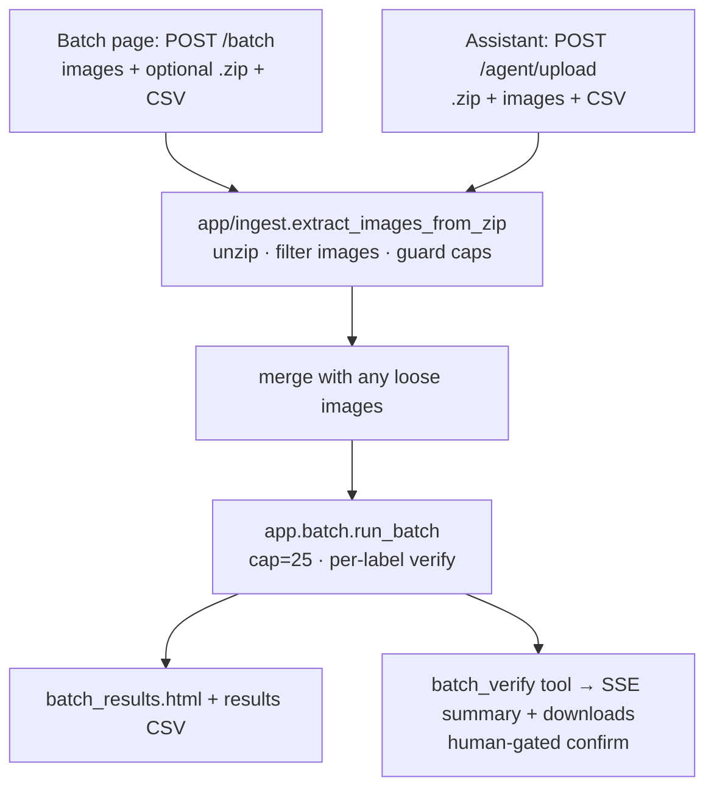

# feat: ZIP-folder ingestion for batch verification, unified across the page and the assistant

## Summary

Let a user verify a whole batch by uploading a **single `.zip` of up to 25 label
photos**: the server unzips it, extracts every image, and runs all of them through
the existing deterministic batch verifier — on **both** the `/batch` page and the
chatbox **Verification assistant**, through **one shared extract path** so behavior
is identical. Also **reproduce, root-cause, and fix** the reported truncation where a
25-label single-transaction upload only processes ~4 labels, so all 25 verify, every
time.

## Problem

The Batch page's "1. Label images (up to 25)" input is a plain multi-file picker
(`<input name="images" accept="image/*" multiple>`); `/batch` reads
`images: list[UploadFile]` and calls `app.batch.run_batch`. There is **no ZIP support
anywhere in the codebase** (`grep zipfile/.zip/ZipFile` is empty), so a user with a
folder of 25 labels must hand-select all 25 — and a reported defect has a single
25-label transaction only processing ~**4** of them. Compliance agents batch-verifying
real label sets feel both: no folder/zip workflow, and an apparent ceiling far below
the advertised 25.

Static analysis does **not** explain the "4": Starlette 0.41.3 / python-multipart
0.0.20 default `max_files` to 1000, and there is no slice, cap, or client-side limit in
the batch path. The cause must be reproduced before it is fixed (see U1).

## Goals / Success Criteria

- A `.zip` containing up to 25 label images, uploaded on the **Batch page**, is
  unzipped server-side and **every** image is verified — per-label PASS/FLAG identical
  to selecting those same images individually.
- The same `.zip` (+ a mapping CSV) dropped into the **assistant** stages all extracted
  images and `batch_verify` runs over the full set, matching each photo to its CSV row.
- A 25-image single transaction (loose files **and** zip) processes **all 25** — the
  ~4-label truncation no longer reproduces.
- Both surfaces share one extract/ingest implementation (parity is enforced by test).
- Invariants preserved: the deterministic core owns every verdict; the in-chat batch
  stays human-gated; 25-label cap unchanged; uploads stay in-process (no disk, no PII);
  per-verify latency unaffected.

## Non-goals

- Raising the 25-label batch cap or adding async / large-batch (>25) handling.
- Browser folder-picking (`webkitdirectory`) — `.zip` is the chosen mechanism
  (per scoping call-out; folder-picker is deferred).
- Changing verdict logic, the CSV schema, or the confirm-gate behavior.
- Nested-archive (zip-in-zip), non-image document ingestion (PDF/HEIC), or password-
  protected archives.

---

## Scope Boundaries

### In scope
- Reproduce + fix the 25→~4 truncation (U1).
- A shared ZIP-extract utility with safety guards (U2).
- Batch-page ZIP ingest: route + template + input `accept` (U3).
- Assistant ZIP ingest: `/agent/upload` + staging + frontend `accept`/chip (U4).
- A cross-surface parity test + README/UX copy (U5).

### Deferred to Follow-Up Work
- `webkitdirectory` folder upload as an alternative to zipping.
- Surfacing a partial-extract summary ("3 non-image files skipped") beyond a simple count.

### Outside scope
- Async batches, >25 labels, nested/encrypted archives, PDF/HEIC.

---

## Decisions (Key Technical Decisions)

- **D1 — `.zip` is the ingest mechanism** (not folder-picker). Reliable single-part
  multipart upload; server owns extraction so both surfaces share it. (Scoping call-out,
  confirmed.)
- **D2 — Over-cap zips are rejected, not truncated.** If a zip yields more than
  `BATCH_MAX_LABELS` (25) images, reject the whole upload with a clear "split it"
  message (reusing `run_batch`'s existing cap message shape). Silent truncation is the
  exact defect this work fixes, so we never truncate. (Scoping call-out, confirmed.)
- **D3 — Non-image entries are skipped, not fatal.** Directories, `__MACOSX/`,
  dotfiles, and non-image extensions are ignored; only files with an image extension
  (the existing `_IMAGE_EXTS` set in `app/main.py`) are extracted. Count of skipped
  entries is reported for the chip/summary but never blocks the run.
- **D4 — One shared extractor.** A single module (`app/ingest.py`) exposes
  `extract_images_from_zip(zip_bytes) -> list[(filename, bytes)]`; both `/batch` and
  `/agent/upload` call it. Parity is a test, not a convention (U5).
- **D5 — Zip-bomb guards.** Cap per-member uncompressed size and total uncompressed
  bytes (reuse the existing 10 MB/file and 50 MB/thread constants where applicable) and
  reject absurd compression ratios, so a malicious zip can't exhaust memory. Extraction
  is in-memory only (no disk), consistent with the no-PII-at-rest invariant.

---

## High-Level Technical Design

Both entry points converge on one extractor and the unchanged deterministic core:

The only new logic is the **extract** box; everything downstream (`run_batch`, the
verdict, the results CSV, the confirm gate) is reused unchanged.

---

## Implementation Units

### U1. Reproduce and fix the 25→~4 truncation
**Goal:** Prove the current ceiling with a failing characterization test, root-cause it,
and fix it so a 25-file single transaction yields 25 result rows.
**Requirements:** Success criterion "a 25-image single transaction processes all 25".
**Dependencies:** none.
**Files:** `tests/test_batch_filecount.py` (create); fix site TBD by root cause —
candidates: `app/main.py` (`batch_run` form parsing / an explicit `request.form()` with
`max_files`/`max_fields`), or a client-side selection limit in `app/templates/batch.html`.
**Approach:** Write an integration test that POSTs 25 distinct image parts to `/batch`
with a matching 25-row CSV and asserts 25 verified rows (not ~4). If it **passes**, the
truncation is specific to the zip workflow (which doesn't exist yet) — record that
finding and let U3/U4's tests carry the 25-count assertion. If it **fails**, identify
the actual limiter (multipart field/file cap, a silent exception swallowing extra parts,
or a template/JS cap) and fix it minimally. Do not assert a cause in advance.
**Execution note:** Characterization-first — land the proving test before any fix.
**Test scenarios:**
- Covers the 25-count criterion: POST 25 image parts + 25-row CSV → exactly 25 rows, none dropped.
- Boundary: 1 image, and exactly 25 images, both fully processed.
- Error path: a row with no matching image and an image with no matching row still report (existing `run_batch` behavior) and don't reduce the processed count of valid pairs.
**Verification:** The new test fails before the fix (or passes and is documented as proving the loose-file path is sound), and passes after; full suite green.

### U2. Shared ZIP-extract utility with safety guards
**Goal:** One in-memory extractor that turns zip bytes into `[(filename, bytes)]` image
pairs, skipping junk and guarding against zip bombs / over-cap sets.
**Requirements:** D3, D4, D5; "both surfaces share one extract path".
**Dependencies:** none (stdlib `zipfile`).
**Files:** `app/ingest.py` (create); `tests/test_zip_ingest.py` (create).
**Approach:** `extract_images_from_zip(zip_bytes, *, max_files=BATCH_MAX_LABELS,
max_file_bytes=..., max_total_bytes=...) -> list[tuple[str, bytes]]`. Use `zipfile.ZipFile`
over a `BytesIO`; iterate `infolist()`; skip directories, `__MACOSX/`, dotfiles, and any
name whose extension isn't in `_IMAGE_EXTS`; read each surviving member with a per-member
uncompressed-size guard (`ZipInfo.file_size`) and a running total guard; raise a typed
error (e.g. `ZipIngestError`) on a bad/corrupt zip, on >max_files images (D2), or on a
size-guard breach. Return `(basename, bytes)` so `run_batch` matches by filename against
the CSV. No disk writes.
**Patterns to follow:** the size-cap constants and `_IMAGE_EXTS` in `app/main.py`; the
friendly-error shape of `app/batch.py` `CsvFormatError`/`run_batch` cap message.
**Test scenarios:**
- Happy path: a 3-image zip → 3 `(name, bytes)` pairs with original basenames; bytes round-trip equal to the source images.
- Filtering: zip containing images + a `.txt` + a `__MACOSX/` entry + a subdirectory → only the images returned; skipped count available.
- Cap (D2): zip with 26 images → raises `ZipIngestError` (over-cap), nothing returned.
- Corrupt input: non-zip bytes / truncated zip → `ZipIngestError`, no crash.
- Zip-bomb guard (D5): a member declaring a huge uncompressed size, and a many-member total over the cap → rejected without reading it all into memory.
- Nested zip: a `.zip` entry inside is treated as a non-image and skipped (Non-goal).
**Verification:** All scenarios pass; no filesystem writes occur during extraction.

### U3. Batch-page ZIP ingest
**Goal:** The `/batch` page accepts a `.zip` (additively to loose images) and verifies
every extracted label.
**Requirements:** Primary page success criterion; D1, D2, D4.
**Dependencies:** U2 (and U1's fix, if the truncation lived in `batch_run`).
**Files:** `app/main.py` (`batch_run`), `app/templates/batch.html` (input `accept` +
helper copy), `tests/test_batch_zip.py` (create).
**Approach:** In `batch_run`, partition uploaded files into zips (by content-type
`application/zip`/`application/x-zip-compressed` or `.zip` extension) and loose images;
expand each zip via `app.ingest.extract_images_from_zip`; concatenate with loose images;
pass the combined `[(filename, bytes)]` list to `run_batch` (which already enforces the
25 cap and emits the over-cap message). Surface `ZipIngestError` as a friendly result
(reuse the `BatchResult.error` path that `batch_results.html` already renders) — never a
500. Update the template input to `accept="image/*,.zip"` and adjust the field hint to
mention "or a .zip of up to 25 labels".
**Patterns to follow:** existing `batch_run` → `run_batch` → `batch_results.html` flow
and its `error`/`results_csv_b64` handling.
**Test scenarios:**
- Happy path: POST a 25-image `.zip` + 25-row CSV → 25 verified rows; per-label verdicts equal selecting those images loose.
- Mixed: a `.zip` of 3 + 2 loose images (5-row CSV) → 5 rows.
- Over-cap (D2): a 26-image zip → friendly error rendered, no 500, no partial run.
- Corrupt zip → friendly error, page renders.
- Regression: existing loose-only multi-file upload still works unchanged.
**Verification:** Manual: drop a 25-label zip on `/batch` → results table shows 25 rows + downloadable results CSV. Tests green.

### U4. Assistant ZIP ingest (parity with the page)
**Goal:** The chatbox ingests a `.zip` (+ CSV) together, stages all extracted images, and
`batch_verify` runs over the full set, matching each to its CSV row.
**Requirements:** Assistant success criterion; D1–D4; in-chat batch stays human-gated.
**Dependencies:** U2.
**Files:** `app/main.py` (`agent_upload`), `app/static/chat-widget.js` +
`app/static/agent.js` (file-input `accept`, drop/paste already route through `uploadFiles`;
add a zip chip message), `app/templates/base.html` + `app/templates/agent.html`
(`accept="image/*,.csv,.zip"`), `tests/test_agent_zip_ingest.py` (create).
**Approach:** In `agent_upload`, detect a `.zip` file → expand via
`extract_images_from_zip` → for each extracted image call the existing
`STORE.put` + `STAGING.add_image` + `STAGING.add_batch_image(thread_id, name, bytes)`
(so the staged batch images carry their basenames for CSV matching), counting bytes
against the existing per-thread cap; return a chip item like
`{"kind": "zip", "name": ..., "extracted": N}`. The CSV upload + `batch_verify` +
confirm-gate flow is unchanged (U5 batch already runs `run_batch` over the staged set).
Frontend: extend the `accept` attrs, and render a "📦 archive.zip (N labels) staged"
chip; reuse existing `uploadFiles` handling for the new `kind`.
**Patterns to follow:** the existing CSV branch in `agent_upload` (validate → stage →
chip), the `STAGING.add_batch_image` path, and the U5 omni-ingest `batch_verify`.
**Test scenarios:**
- Happy path: POST a 25-image zip + a 25-row CSV to `/agent/upload` → `STAGING.get_batch(thread)` holds 25 images; `batch_verify` over that thread returns 25 rows matching `run_batch` directly (parity), behind the confirm gate.
- Over-cap zip → friendly rejected item, nothing staged, no 500.
- Cap accounting: a zip's extracted bytes count toward the per-thread cap (`_thread_bytes`); an over-cap cumulative upload is rejected with the existing message.
- Eviction: `/agent/reset` clears zip-staged images (existing `STAGING.clear`).
- Corrupt zip → friendly rejected item.
**Verification:** Manual: drop a zip + CSV in the widget → "verify all" → Approve → streamed summary over all labels + results-CSV download. Tests green.

### U5. Cross-surface parity test + docs/UX copy
**Goal:** Lock identical behavior across both surfaces and document the feature.
**Requirements:** "both surfaces share one extract path"; parity success criterion.
**Dependencies:** U3, U4.
**Files:** `tests/test_zip_parity.py` (create); `README.md` (batch + assistant sections);
minor copy already touched in U3/U4 templates.
**Approach:** A test that takes one fixture zip + CSV and asserts the Batch-page result
rows and the assistant `batch_verify` rows are equal (same filenames, same statuses, same
count) and both equal `run_batch` on the directly-extracted set. Update README to
document ".zip of up to 25 labels" on both the Batch page and the in-chat assistant, and
the over-cap/skip behavior.
**Test scenarios:**
- Parity: identical filenames + statuses + count across `/batch`, `batch_verify`, and direct `run_batch` for the same zip+CSV.
- Documents the over-cap and non-image-skip behavior with one assertion each (shared `app.ingest` contract).
**Test expectation:** parity + contract assertions above; README change is non-behavioral.
**Verification:** Parity test green; README renders the new capability on both surfaces.

---

## Risks & Mitigations

- **The "~4" cause is non-obvious (no static explanation).** Mitigation: U1 is
  characterization-first and explicitly does not presume a cause; if 25 loose files
  already work, the finding is recorded and the zip-count assertions in U3/U4 carry the
  guarantee.
- **Zip bombs / memory exhaustion.** Mitigation: per-member + total uncompressed-size
  guards and an image-count cap in U2 (D5); in-memory only, no disk.
- **Filename collisions inside a zip** (two `label.png` in different folders) → CSV
  matching ambiguity. Mitigation: U2 returns basenames; duplicate basenames inherit
  `run_batch`'s existing duplicate-handling rows; add a test if U2 surfaces collisions.
- **Breaking the existing loose-file path or the in-chat batch.** Mitigation: regression
  scenarios in U3/U4 and the U5 parity test; additive `accept` attrs.

## Verification Strategy

- Per-unit tests above; full `pytest` suite stays green at each unit.
- Parity test (U5) is the cross-surface guarantee.
- Manual demo per surface: 25-label zip on `/batch`; zip+CSV in the assistant → Approve →
  streamed summary + results CSV.

## Sources & Research

- This codebase: `app/main.py` (`/batch`, `/agent/upload`, `_IMAGE_EXTS`, cap constants),
  `app/batch.py` (`run_batch`, `BATCH_MAX_LABELS`, `parse_csv`, `results_to_csv`,
  `CsvFormatError`), `agent/tools.py` (`batch_verify`), `agent/images.py` (`STORE`,
  `STAGING`), `app/templates/batch.html`, `app/static/chat-widget.js` / `agent.js`.
- Prior plan `docs/plans/2026-06-19-001-feat-chatbox-omni-ingest-plan.md` (the in-chat
  batch this extends) and the omni-ingest invariants.
- Versions confirmed locally: Starlette 0.41.3, python-multipart 0.0.20 (multipart
  `max_files` default 1000 — rules out a 4-file multipart cap; reinforces U1 repro).
