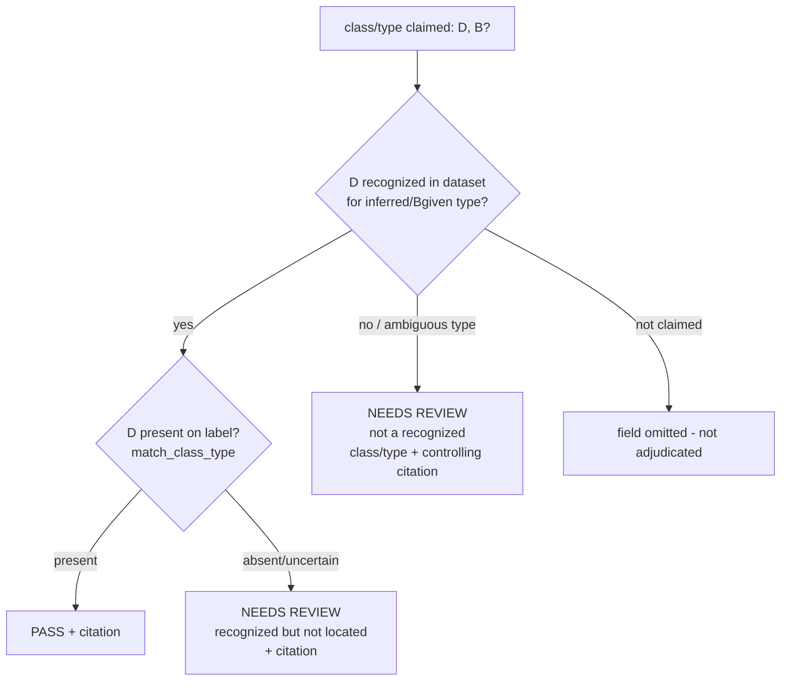

# feat: Standards-of-identity validation for class/type designations

## Summary

Promote the currently-advisory class/type check toward **deterministic validity** by
adding a curated, citation-tagged dataset of the recognized 27 CFR class/type
designations for **wine (Part 4)** and **distilled spirits (Part 5)**, and wiring a
recognition layer into the verification core. A claimed class/type that is a recognized
designation **and** present on the label produces a deterministic **PASS**; an
unrecognized or uncertain designation defers to **NEEDS REVIEW** with the controlling
citation. It **never** produces a confident "invalid" FLAG — asserting a designation is
*not* really (e.g.) Bourbon from a label alone is exactly where the tool would be
confidently wrong, which the system's headline metric forbids.

---

## Problem Frame

Today `match_class_type` (deterministic) checks only **presence** — is the claimed
designation fuzzily on the label — and `agent.tools.validate_class_type` (advisory,
chat-only) checks **recognition** against a hardcoded `_KNOWN_WINE_TYPES` set of eight
wine strings, returning OK/REVIEW + a RAG citation but "never an automatic rejection."

Gaps:
- **No spirits coverage.** A claimed "Bourbon" / "London Dry Gin" / "Blanco Tequila"
  has no recognized-designation backing at all.
- **Recognition is invisible to the deterministic verdict.** The button/batch path
  can mark a class/type PASS purely on presence, even when the claimed string is not a
  valid 27 CFR class/type.
- **The wine list is a bare hardcoded set** — no citations, no provenance, drifts from
  the regulation.

Who feels it: TTB reviewers adjudicating class/type, and the agency's audit posture
(an unrecognized designation should be *surfaced for review with the controlling rule*,
not silently passed).

This is **compliance-core** work bound by the invariant: **zero confident-wrong
verdicts** (`STRATEGY.md`, margin of error < 1%, false negatives = 0).

---

## Requirements

- **R1 — Recognized-designation dataset.** A committed, offline, citation-tagged dataset
  of recognized class/type designations for wine (Part 4 §4.21) and spirits (Part 5
  Subpart I). Each entry carries its controlling section + `source_url`, mirroring the
  existing corpus provenance discipline.
- **R2 — Deterministic recognition layer.** A pure, offline function that answers
  "is this claimed designation a recognized class/type (and for which beverage type)?"
  with the controlling citation.
- **R3 — Verdict posture (locked).** Recognized + present → **PASS**. Unrecognized or
  uncertain → **NEEDS REVIEW** with citation. **Never a confident FLAG** for
  non-recognition. (User decision, this session.)
- **R4 — Cross-surface parity.** Recognition applies wherever class/type is adjudicated
  today: single-label (image/text), batch CSV, and the chat verify tools; and the
  advisory `validate_class_type` tool is upgraded to the dataset.
- **R5 — Eval coverage.** The eval set proves recognized→PASS and unrecognized→NEEDS
  REVIEW across wine + spirits, with **zero confident-wrong** outcomes.
- **R6 — Offline.** No runtime network; the dataset is provisioned at build time like
  the rest of the corpus.

---

## Key Technical Decisions

**KTD1 — Recognition is membership against a curated list, not compositional rule
enforcement.** We validate that a claimed designation *is a recognized 27 CFR class/type*
for its beverage type. We do **not** enforce the compositional standards (aging, mash
bill, ABV/proof floors, grape-variety percentages) — those need data not present on a
label and are the dominant confident-wrong risk. (Scope boundary; see below.)

**KTD2 — Verdict posture: PASS or NEEDS REVIEW, never FLAG for non-recognition.**
Recognition is wired as an additive signal: an unrecognized claimed designation forces
the class/type field to `inconclusive` (→ NEEDS REVIEW) and attaches the controlling
citation. It never converts a result to a confident FLAG. This preserves the
deliberate "never an auto-rejection" design of the existing advisory tool while making
recognition *visible* to the deterministic verdict. (Locked: R3.)

**KTD3 — Dataset shape mirrors `rag/corpus/cfr_excerpts.json`.** A new
`rag/corpus/class_type_designations.json` with the same provenance fields
(`part`, `section`, `beverage_type`, `source_url`, `effective_date`) plus the
designation strings and any aliases/synonyms. Section numbers are eCFR-verified the same
way `rag/corpus/ecfr_verified.json` was (numbers verified against the live structure
API; wording a faithful summary — confirm against `source_url` before operational use).

**KTD4 — Beverage type is inferred from the designation; no new input is added to the
verify surfaces in this scope.** The single-label (image/text), batch, and chat verify
paths do **not** currently supply a beverage type, and this plan does **not** add one —
recognition infers the beverage type from the matched dataset entry. The advisory
`validate_class_type` tool's existing `beverage_type` parameter remains the only explicit
override. A designation that maps to >1 beverage type with no override → defer (NEEDS
REVIEW), never a guess. Adding an explicit `beverage_type` field across the verify
surfaces (and OCR-context inference, e.g. ABV in the spirits range) is **deferred**
follow-up, not this plan. (Resolves the "where does beverage type come from" gap.)

**KTD7 — Recognition matches a recognized designation *within* the claimed string, using
word-boundary/token matching — never exact-equality, never naive substring.** A reviewer
enters a full claimed designation like "Kentucky Straight Bourbon Whiskey"; exact-set
membership would defer nearly every real claim, gutting the feature. So recognition tests
whether the claim *contains* a recognized class/type token or phrase. Critically, the
match must be **word-boundary aware** — naive substring containment would re-introduce the
exact incidental-overlap defect fixed this session in `match_class_type` ("gin" inside
"Virginia", "rum"/"port" inside unrelated words). Reuse the normalization +
discriminating-token discipline from `app/matching.py`; short designations match only as
whole tokens. (This is the highest-risk correctness decision in the feature — see Risks.)

**KTD5 — Recognition composes with, does not replace, the presence check.** Presence
(`match_class_type`, fixed earlier this session) stays the source of "is it on the
label." Recognition adds "is the claimed designation valid." A class/type field is PASS
only when **recognized AND present**; otherwise it defers (recognition unknown) or
follows the existing presence verdict (recognized-but-different is the existing
present-but-different signal). The interaction table is in the HTD.

**KTD6 — Citations via the committed dataset, not a runtime RAG call.** The deterministic
path must stay on the < 5 s hot path and fully offline/deterministic, so the controlling
citation comes from the dataset entry, not from `generate.explain_flag` (which the
advisory tool may still use for richer prose).

---

## High-Level Technical Design

Recognition flow for a claimed class/type designation `D` (beverage type `B`, optional):

Verdict interaction (recognition × presence), honoring "never confident-FLAG for
non-recognition":

| Recognized? | Present on label? | Verdict | Note |
|---|---|---|---|
| Yes | Yes | **PASS** | valid designation, on label |
| Yes | No / uncertain | **NEEDS REVIEW** | valid but not located — defer + cite |
| Yes | Different discriminating designation present | **FLAG** | existing present-but-different presence signal (unchanged) |
| No / ambiguous | any | **NEEDS REVIEW** | not a recognized class/type — defer + controlling citation |
| (not claimed) | — | omitted | optional field, never adjudicated when absent |

---

## Scope Boundaries

### In scope
- Recognized-designation dataset for wine (Part 4) + spirits (Part 5), citation-tagged.
- Deterministic recognition layer + integration into the class/type verdict (PASS /
  NEEDS REVIEW + citation).
- Parity across single-label, batch, chat; upgrade of the advisory tool.
- Eval coverage proving the posture.

### Deferred to Follow-Up Work
- **Malt beverages (Part 7)** class/type designations — same pattern, separate dataset
  slice.
- **Compositional standards-of-identity enforcement** (aging, mash bill, ABV/proof
  floors, varietal %), and the label-data extraction it would require.
- **Geographic/distinctive designations** (e.g. "Scotch", "Tequila", "Cognac") as
  *origin* enforcement beyond name recognition.

### Outside this product's identity
- Auto-**rejection** of a designation (a confident "invalid" FLAG). Permanently a
  non-goal per the zero-confident-wrong invariant and KTD2.

---

## Implementation Units

### U1. Recognized-designations dataset
- **Goal:** A committed, offline, citation-tagged dataset of recognized class/type
  designations for wine and spirits.
- **Requirements:** R1, R6.
- **Dependencies:** none.
- **Files:** `rag/corpus/class_type_designations.json` (create);
  `rag/corpus/ecfr_verified.json` (**modify** — add the new sections, e.g. §4.21 and the
  Part 5 Subpart I sections like §5.143, each keyed to its part); `tests/test_class_type_dataset.py`
  (create); `tests/test_rag.py` (extend the existing eCFR-verified guard, or add a
  parallel one, to cover the designations dataset).
- **Approach:** Mirror the `cfr_excerpts.json` chunk schema. One entry per recognized
  designation (or designation family) with: `designation`, optional `aliases`,
  `beverage_type` (`wine` | `spirits`), `part`, `section`, `source_url`,
  `effective_date`, short `note`. Wine from §4.21 (table/light, dessert, sparkling,
  carbonated, citrus, fruit, aromatized) + the grape-varietal allowance; spirits from
  Part 5 Subpart I (whisky + bourbon/rye/corn/wheat/malt/Scotch/Irish/Canadian types,
  neutral spirits/vodka, gin + Dry/London/Old Tom, brandy, rum, agave spirits
  /tequila/mezcal, cordials & liqueurs, brandy types). **Every cited section must be
  added to `ecfr_verified.json["sections"]` under its part** (the existing
  `test_every_chunk_cites_an_ecfr_verified_section` guard in `tests/test_rag.py` is the
  model — guard the §5.66→§5.74 class of error for the new dataset too). Section numbers
  eCFR-verified; wording a faithful conservative summary. Curated data is the
  deliverable — exact enumeration is implementation-time curation against the cited
  sources.
- **Patterns to follow:** `rag/corpus/cfr_excerpts.json` provenance fields;
  `rag/corpus/ecfr_verified.json` `sections` map; `tests/test_rag.py`
  `test_every_chunk_cites_an_ecfr_verified_section`.
- **Test scenarios:**
  - Schema/integrity (`tests/test_class_type_dataset.py`): every entry has a non-empty
    `designation`, a valid `beverage_type` (`wine`|`spirits`), a `section`, and a
    `source_url`; designations unique within a beverage type after normalization; the
    file parses and is non-empty for both wine and spirits.
  - eCFR-verified guard: **every `section` cited by the designations dataset exists in
    `ecfr_verified.json["sections"]` under the matching `part`** — same assertion shape as
    the corpus guard, so a wrong/nonexistent section number fails loudly and offline.
- **Verification:** The dataset loads, passes both the integrity test and the
  eCFR-verified-section guard, and covers the named wine + spirits classes/types.

### U2. Deterministic recognition module
- **Goal:** A pure, offline function answering "is `D` a recognized class/type, for which
  beverage type, under which citation?"
- **Requirements:** R2, R4, R6.
- **Dependencies:** U1.
- **Files:** `app/standards.py` (create); `tests/test_standards.py` (create).
- **Approach:** Load the dataset once (module-level, like the corpus loaders). Normalize
  with the existing `matching.normalize_loose`. Expose
  `recognize(designation, beverage_type=None) -> RecognitionResult` with
  `{recognized: bool, beverage_type: str | None, citation: {section, source_url} | None,
  message: str}`. Match by **whole-token containment** (KTD7): the claimed string is
  recognized if it contains a recognized designation/alias as a token or token sequence —
  so "Kentucky Straight Bourbon Whiskey" matches "Bourbon". Match on token boundaries,
  **not** naive substring, so a short designation can't match incidentally ("gin" must not
  match inside "Virginia", "port"/"rum" not inside unrelated words) — the exact defect
  fixed this session in `match_class_type`. Infer beverage type from the matched entry;
  honor a supplied `beverage_type` as a filter/override; matches in >1 beverage type with
  no override → not recognized / defer. No RAG call, no network (KTD6).
- **Patterns to follow:** corpus loading in `rag/ingest.py`; `normalize_loose` and the
  discriminating-token guard in `app/matching.py` (`_best_fuzzy_line`).
- **Test scenarios:**
  - Happy (exact): "Bourbon"/"bourbon whiskey" → recognized, spirits, §5.143; "Cabernet
    Sauvignon"/"Table Wine" → recognized, wine, §4.21.
  - Happy (full designation, containment): "Kentucky Straight Bourbon Whiskey" → recognized
    spirits; "Blanco Tequila" → recognized spirits (agave); "Napa Valley Cabernet
    Sauvignon" → recognized wine.
  - Alias/case/whitespace: "LONDON DRY GIN", "london dry gin" → recognized spirits.
  - **Word-boundary false-positive guard:** "Virginia Dare" must NOT match "gin";
    a string containing "import"/"sport" must NOT match "port"/"rum" — short designations
    match only as whole tokens.
  - Unrecognized: "Unicorn Tears", "Hard Kombucha" → not recognized, citation None.
  - Beverage-type override: a wine-only designation queried with `beverage_type="spirits"`
    → not recognized.
  - Offline: runs with outbound sockets blocked (mirror `tests/test_offline.py` guard).
- **Verification:** Recognition is correct for the enumerated cases (including full
  designations and the false-positive guard) and makes no network call.

### U3. Integrate recognition into the class/type verdict
- **Goal:** Make recognition visible to the deterministic verdict per the locked posture.
- **Requirements:** R3, R4.
- **Dependencies:** U2.
- **Files:** `app/matching.py` and/or `app/verify.py`; `tests/test_adjudicated_fields.py`
  (extend).
- **Approach:** In the class/type adjudication path, after the presence check, consult
  `standards.recognize`. If **not recognized** → force the field to `inconclusive`
  (NEEDS REVIEW) and put the controlling citation (or "not a recognized 27 CFR class/type")
  in `detail` — never a confident FLAG (KTD2). If **recognized** → keep the presence
  verdict (PASS when present; the existing present-but-different FLAG is unchanged, since
  that is a presence signal, not a recognition one). Net effect: a recognized+present
  designation PASSes; an unrecognized string that *is* on the label no longer PASSes — it
  defers with a citation. Keep the change additive and behind the existing optional-field
  gate (only when class/type is claimed). Confirm `_needs_review`/`overall_pass` propagate
  the inconclusive correctly (they already do for warning/net-contents).
- **Execution note:** Add the new behavior test-first — assert recognized→PASS and
  unrecognized-but-present→NEEDS REVIEW before wiring, to lock the posture.
- **Patterns to follow:** the three-way PASS/FLAG/defer verdict in `match_net_contents`;
  the inconclusive→NEEDS REVIEW propagation in `app/verify.py::_needs_review`.
- **Test scenarios:**
  - Recognized + present → PASS (e.g. claim "Bourbon" on a label reading "Kentucky
    Straight Bourbon Whiskey"). Covers R3.
  - Unrecognized + present on label → NEEDS REVIEW + citation/message, **not** PASS,
    **not** FLAG. Covers R3 (the core guarantee).
  - Recognized + absent → NEEDS REVIEW (recognized-but-not-located).
  - Omitted class/type → field not adjudicated (unchanged).
  - Overall verdict: an unrecognized class/type defers the whole result to NEEDS REVIEW,
    never confident-wrong.
- **Verification:** No confident FLAG is ever produced for a non-recognition; recognized
  designations PASS when present.

### U4. Upgrade the advisory `validate_class_type` tool to the dataset
- **Goal:** Replace the hardcoded `_KNOWN_WINE_TYPES` with the shared dataset so the chat
  advisory covers wine + spirits with citations.
- **Requirements:** R4.
- **Dependencies:** U2.
- **Files:** `agent/tools.py`; `tests/test_agent_tools.py` (extend).
- **Approach:** Route `validate_class_type` through `standards.recognize`; keep its
  advisory contract (OK/REVIEW, never auto-rejection) and its optional richer RAG prose
  via `generate.explain_flag`, but ground the OK/REVIEW decision in the dataset. Remove
  `_KNOWN_WINE_TYPES`. Roster size/count tests unaffected (no tool added/removed).
- **Patterns to follow:** the existing `validate_class_type` advisory shape.
- **Test scenarios:** "Bourbon" → OK + spirits citation; "Cabernet Sauvignon" → OK + wine
  citation; "Unicorn Tears" → REVIEW; advisory contract preserved (no FLAG/auto-reject).
- **Verification:** The advisory tool reflects wine + spirits recognition with citations;
  `_KNOWN_WINE_TYPES` is gone.

### U5. Surface recognition citation across UI + batch + chat
- **Goal:** Show the recognition verdict + controlling citation wherever class/type is
  adjudicated.
- **Requirements:** R4.
- **Dependencies:** U3.
- **Files:** `app/templates/results.html` (citation already renders via `flag_reason`/
  `detail` — verify the class/type citation shows); `app/batch.py` (the REVIEW verdict
  already flows; confirm the citation/message rides along); `agent/tools.py` verify-tool
  serialization (the field `detail` carries the citation).
- **Approach:** Mostly verification + small display wiring — the results view already
  renders `inconclusive` as REVIEW and shows `detail`/`flag_reason`. Ensure the
  recognition citation lands in a user-visible field on all three surfaces. No new verdict
  logic.
- **Patterns to follow:** how the §16.21 warning citation surfaces in `results.html`.
- **Test scenarios:** a web test that an unrecognized class/type renders a REVIEW card
  with the citation/message; batch CSV REVIEW row carries the field; chat tool result
  includes the citation in the class/type field detail.
- **Verification:** The controlling citation is visible to the reviewer on every surface.

### U6. Eval coverage for the recognition posture
- **Goal:** Lock the posture in the eval harness — zero confident-wrong across wine +
  spirits.
- **Requirements:** R5.
- **Dependencies:** U3.
- **Files:** the verifier eval set (`eval/` — mirror how `eval/run_eval.py` /
  `eval/REPORT.md` enumerate cases) and/or `eval/rag_golden.json` for the citation
  grounding; `tests/` as needed.
- **Approach:** Prove the posture primarily at the **unit/integration level** (the U3
  tests over `verify_fields`/`reverify_text` with text input) — these are cheap, offline,
  and already the right granularity for recognition. Add a focused set of **text-based**
  recognition cases (recognized wine + spirits → PASS when present; unrecognized →
  NEEDS REVIEW) rather than new generated **spirits label images**, which are expensive and
  not needed to prove recognition. Creating spirits image-board fixtures is **explicitly
  deferred** — note it in the eval report so coverage scope isn't overstated. Assert the
  existing decision board's margin-of-error stays 0% and no confident-wrong is introduced.
- **Patterns to follow:** the text/reverify path used by `tests/test_adjudicated_fields.py`;
  existing eval case structure in `eval/`.
- **Test scenarios:** recognized→PASS and unrecognized→NEEDS REVIEW asserted over the text
  path for both wine and spirits; 0 confident-wrong; the existing 16/16 image board is
  unaffected (no new image fixtures required).
- **Verification:** The recognition posture is proven by green text-level cases + the U3
  integration tests; `eval/run_eval.py` (and the RAG golden if touched) stays green; the
  deferral of spirits image fixtures is recorded, not silently skipped.

---

## Risks & Dependencies

- **Containment false-positives (highest correctness risk).** Recognizing a designation
  *within* a free-text claim (KTD7) risks incidental matches — "gin" in "Virginia", "rum"/
  "port" in unrelated words — which is the exact confident-wrong defect fixed this session
  in `match_class_type`. Mitigation: whole-token (word-boundary) matching only, short
  designations as whole tokens, and an explicit false-positive test guard in U2. A false
  *recognition* would wrongly PASS an invalid designation — a confident-wrong — so this is
  the load-bearing test of the feature.
- **Curation accuracy (compliance risk).** A wrong section number or a "recognized"
  designation that isn't, undermines trust. Mitigation: eCFR-verify section numbers
  (KTD3), add every cited section to `ecfr_verified.json` under the existing guard (U1),
  keep `source_url` per entry, and frame wording as a faithful summary to confirm against
  the source — same discipline as the existing corpus.
- **Snapshot maintenance.** `ecfr_verified.json` must gain the new sections (§4.21, Part 5
  Subpart I) or the guard fails; refreshing it follows the existing offline-snapshot note
  (re-query the eCFR structure API at curation time, not runtime).
- **Over-deferral (product risk).** If the dataset is thin, many legitimate designations
  defer to NEEDS REVIEW, eroding the field's value. Mitigation: cover the common classes
  + types first; deferral is the *safe* direction, so coverage can grow incrementally.
- **Beverage-type ambiguity.** A designation valid in two contexts with no supplied type
  defers rather than guessing (KTD4) — correct but worth noting in the dataset design.
- **Hot-path budget.** Recognition is an in-memory dataset lookup (no RAG/network), so the
  < 5 s budget and offline invariant hold (KTD6).
- **Dependency:** builds directly on this session's `match_class_type` presence fix and
  the optional-field threading (single-label, batch, chat) already merged.

---

## Open Questions (deferred to implementation)

- Exact dataset granularity: one entry per designation vs. per class with a `types` list —
  decide when curating U1 against the cited sources.
- Whether to infer beverage type from the *image/OCR context* (e.g. an ABV in the
  spirits range) as a secondary disambiguator, or rely solely on the designation +
  supplied `beverage_type` (KTD4). Resolve when wiring U3.
- Whether the recognition citation should reuse the RAG citation shape (`reasons`/
  `flag_reason`) or a dedicated field — decide against the `results.html` rendering in U5.

---

## Sources & Research

- 27 CFR Part 4 Subpart C / §4.21 — Standards of identity for wine:
  https://www.ecfr.gov/current/title-27/chapter-I/subchapter-A/part-4/subpart-C/section-4.21
- TTB Wine BAM Chapter 5 — Class and Type Designation:
  https://www.ttb.gov/system/files/images/pdfs/wine_bam/c5-class-and-type-designation.pdf
- 27 CFR Part 5 Subpart I — Standards of identity for distilled spirits (incl. §5.143 Whisky):
  https://www.ecfr.gov/current/title-27/chapter-I/subchapter-A/part-5/subpart-I
- Existing in-repo patterns: `rag/corpus/cfr_excerpts.json` (provenance schema),
  `rag/corpus/ecfr_verified.json` (verification discipline), `agent/tools.py`
  (`validate_class_type`, `_KNOWN_WINE_TYPES`), `app/matching.py` (`match_class_type`,
  three-way verdict), `app/verify.py` (`_needs_review` propagation), `STRATEGY.md`
  (zero-confident-wrong invariant).
